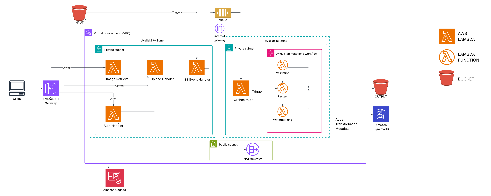
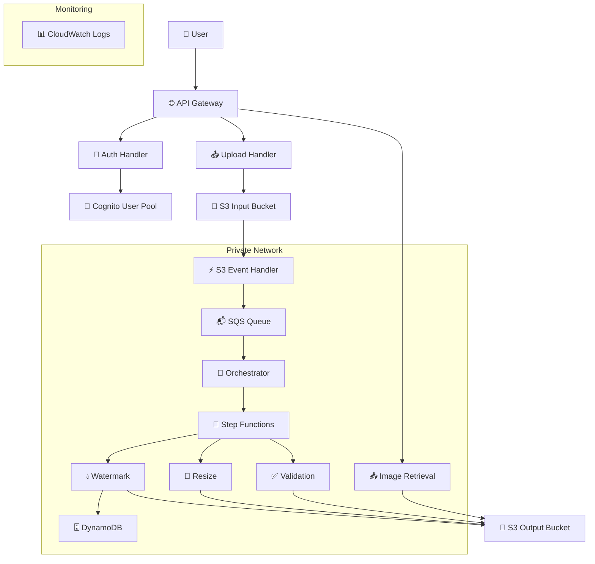
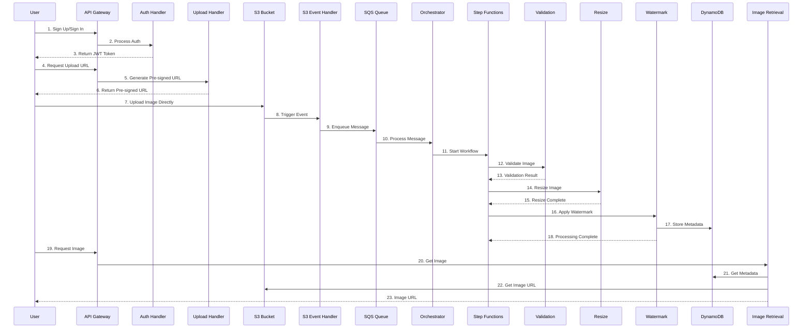

# Serverless Image Management System

A serverless image management system using **AWS Lambda**, **S3,** and **DynamoDB** for secure, scalable image upload, processing, and metadata storage.


## 🎥 Project Overview

 This project showcases a serverless image management system built on AWS that handles image uploads, processing, and metadata storage with high efficiency. When a user uploads an image to Amazon S3, an AWS Lambda function is triggered to perform tasks such as validation, resizing, and watermarking. Metadata including image ID, user ID, upload timestamp, and processing status is stored in DynamoDB, allowing for easy tracking and querying.

The system follows an event-driven architecture that responds automatically to image uploads and scales based on demand. It is designed to be secure, cost-effective, and suitable for applications that require dynamic image handling without the complexity of managing infrastructure.


### 🚀 **Key Capabilities**

* **🔐 User Access & Identity Control** Manage user registration, login, and permissions securely using AWS Cognito.

* **📤 Seamless Image Uploads** Enable direct uploads to Amazon S3 through pre-signed URLs, keeping credentials safe.

* **🔄 Intelligent Processing Workflow** Automatically process images upon upload using an event-driven Lambda pipeline.

* **🖼️ Enhanced Image Handling** Perform key operations like validation, resizing for performance, and watermarking for protection.

* **🔒 Secure Internal Communication** Ensure all service interactions occur within a protected AWS VPC environment.

* **📊 Structured Metadata Storage** Store and retrieve image-related data efficiently with DynamoDB for better organization.

* **⚡ Scalable Serverless Setup** Leverage AWS Lambda and other managed services to scale effortlessly without managing servers.

* **💰 Optimized Cost Model** Benefit from a pay-per-use structure that keeps operational costs low and predictable.
  
  

## 🏗️ Architecture

### Architecture Diagram




### High-Level Architecture



### Detailed Component Flow



## 🛠️ Technology Stack

| Component          | Technology         | Purpose                |
| ------------------ | ------------------ | ---------------------- |
| **API Layer**      | AWS API Gateway    | REST API endpoints     |
| **Authentication** | AWS Cognito        | User management & auth |
| **Compute**        | AWS Lambda         | Serverless functions   |
| **Storage**        | Amazon S3          | Image storage          |
| **Database**       | Amazon DynamoDB    | Metadata storage       |
| **Queue**          | Amazon SQS         | Event processing       |
| **Orchestration**  | AWS Step Functions | Workflow management    |
| **Networking**     | Amazon VPC         | Private networking     |
| **Security**       | AWS KMS            | Encryption             |
| **Monitoring**     | Amazon CloudWatch  | Logging & metrics      |

## 📁 Project Structure

```
  📁 Serverless-Image-Management-System/
├── terraform/                 # Infrastructure as Code
│   ├── vpc.tf                 # VPC and networking
│   ├── api_gateway.tf         # API Gateway config
│   ├── lambda.tf              # Lambda functions
│   ├── s3.tf                  # S3 bucket setup
│   ├── dynamodb.tf            # DynamoDB tables
│   ├── step_functions.tf      # Workflow orchestration
│   ├── cognito.tf             # User pool and auth
│   └── security.tf            # IAM roles, KMS keys
├── src/lambda/               # Lambda function code
│   ├── auth_handler/          # Cognito integration
│   ├── upload_handler/        # Pre-signed URL generator
│   ├── s3_event_handler/      # S3 trigger processor
│   ├── orchestrator/          # Step Function logic
│   ├── validation/            # Image validation
│   ├── resize/                # Resizing logic
│   ├── watermark/             # Watermarking logic
│   └── image_retrieval/       # Retrieval endpoint
├── docs/                     # Documentation
│   ├── architecture.md        # System design
│   ├── api.md                 # API reference
│   ├── deployment.md          # Setup instructions
├── Architecture-diagram/                 # Architecture visuals
├── README.md                 # Project overview
└── DEPLOYMENT.md             # Quick deployment guide

```

## ⚡ Setup Guide

### Prerequisites

- AWS CLI configured with appropriate permissions
- Terraform >= 1.0
- Python 3.11+ (for Lambda functions)

### Deployment

1. **Setup all files**
2. **Deploy infrastructure**
3. **Deploy Lambda functions**
4. **Test the platform**

For detailed deployment instructions, see [DEPLOYMENT.md](DEPLOYMENT.md).

## 📚 API Reference

### Authentication Endpoints

| Endpoint                        | Method | Description                 |
| ------------------------------- | ------ | --------------------------- |
| `/auth/signup`                  | POST   | User registration           |
| `/auth/signin`                  | POST   | User login                  |
| `/auth/verify`                  | POST   | Email verification          |
| `/auth/forgot-password`         | POST   | Password reset request      |
| `/auth/confirm-forgot-password` | POST   | Password reset confirmation |

### Image Processing Endpoints

| Endpoint            | Method | Description               |
| ------------------- | ------ | ------------------------- |
| `/upload`           | POST   | Get pre-signed upload URL |
| `/image/{image_id}` | GET    | Retrieve processed image  |

### Example Usage

#### User Registration

```bash
curl -X POST https://your-api-gateway-url/auth/signup \
  -H "Content-Type: application/json" \
  -d '{
    "email": "user@example.com",
    "password": "SecurePassword123!"
  }'
```

#### User Authentication

```bash
curl -X POST https://your-api-gateway-url/auth/signin \
  -H "Content-Type: application/json" \
  -d '{
    "email": "user@example.com",
    "password": "SecurePassword123!"
  }'
```

#### Get Upload URL

```bash
curl -X POST https://your-api-gateway-url/upload \
  -H "Authorization: Bearer <your_jwt_token>" \
  -H "Content-Type: application/json" \
  -d '{
    "filename": "image.jpg",
    "content_type": "image/jpeg"
  }'
```

#### Upload Image

```bash
curl -X PUT "<pre-signed-url>" \
  -H "Content-Type: image/jpeg" \
  -H "x-amz-server-side-encryption: aws:kms" \
  -H "x-amz-server-side-encryption-aws-kms-key-id: <kms-key-id>" \
  --upload-file "image.jpg"
```

#### Retrieve Processed Image

```bash
curl -X GET "https://your-api-gateway-url/image/<image-id>?size=medium" \
  -H "Authorization: Bearer <your_jwt_token>"
```

For complete API documentation, see [docs/api.md](docs/api.md).

### 🧱  **Infrastructure as Code**

* **📁 Modular IaC**: All AWS resources are provisioned using Terraform modules

* **🔄 Repeatable Deployments**: Infrastructure can be recreated consistently across environments

* **🔐 Secrets Management**: Sensitive values are handled securely via environment variables or secret store

## 🔐 **Security & Access Control**

- **📈 CloudWatch Logs**: Centralized logging for all Lambda functions
- **🔍 X-Ray Tracing**: Distributed tracing for request flows
- **📊 Metrics**: Built-in AWS service metrics
- **🚨 Error Tracking**: Detailed error logging and monitoring

## 💰 Cost Optimization

- **⚡ Serverless**: Pay only for actual usage
- **🔄 Auto-scaling**: Automatic scaling based on demand
- **📦 S3 Lifecycle**: Automatic data lifecycle management
- **🗄️ DynamoDB On-Demand**: Pay-per-request pricing
- **📊 Log Retention**: Configurable log retention periods
  
  

## 📊 **Monitoring & Diagnostics**

* **📈 Centralized Logging**: All Lambda functions stream logs to Amazon CloudWatch

* **🔍 Distributed Tracing**: AWS X-Ray provides end-to-end visibility into request flows

* **📊 Performance Metrics**: Real-time service metrics help monitor system health

* **🚨 Error Insights**: Failures and exceptions are tracked for fast debugging

## 🧪 Testing

The platform includes comprehensive testing capabilities for authentication flow, image upload and processing, and image retrieval.

## 📖 Documentation

- **[Architecture Guide](docs/architecture.md)**: Detailed architecture explanation
- **[API Documentation](docs/api.md)**: Complete API reference
- **[Deployment Guide](DEPLOYMENT.md)**: Step-by-step deployment instructions
- **[Component Guides](docs/)**: Individual component documentation
