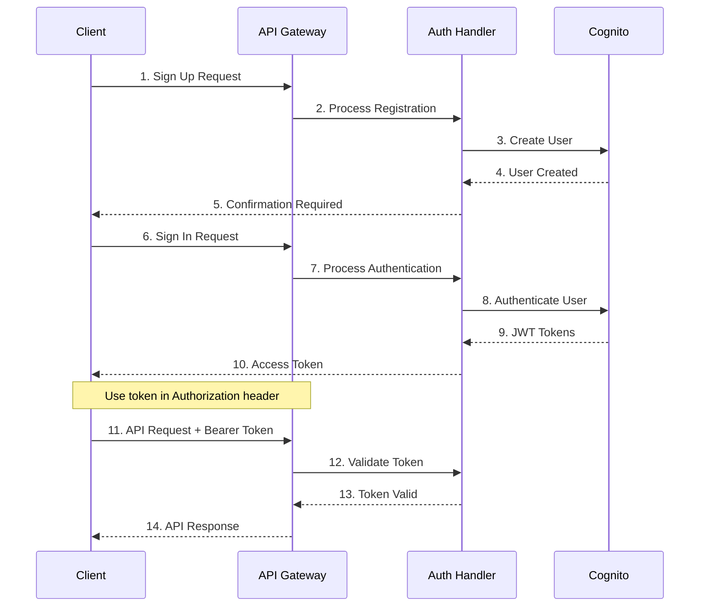

# API Documentation

## Overview

The Serverless Image Processing Platform provides a comprehensive REST API for user authentication, image upload, and image retrieval. All endpoints are secured with JWT authentication and operate within a private network architecture.

## 🔐 Authentication

### Authentication Flow



### JWT Token Format

The platform uses AWS Cognito JWT tokens for authentication. Include the token in the `Authorization` header:

```
Authorization: Bearer <jwt_token>
```

## 📡 API Endpoints

### Base URL

All API endpoints are relative to your API Gateway URL:

```
https://<api-gateway-id>.execute-api.<region>.amazonaws.com/<stage>
```

### Authentication Endpoints

#### User Registration

**Endpoint:** `POST /auth/signup`

**Description:** Register a new user account

**Request Body:**
```json
{
  "email": "user@example.com",
  "password": "SecurePassword123!"
}
```

**Response:**
```json
{
  "success": true,
  "message": "User registered successfully. Please check your email for verification."
}
```

**Example:**
```bash
curl -X POST https://your-api-gateway-url/auth/signup \
  -H "Content-Type: application/json" \
  -d '{
    "email": "user@example.com",
    "password": "SecurePassword123!"
  }'
```

#### User Authentication

**Endpoint:** `POST /auth/signin`

**Description:** Authenticate user and receive JWT token

**Request Body:**
```json
{
  "email": "user@example.com",
  "password": "SecurePassword123!"
}
```

**Response:**
```json
{
  "success": true,
  "token": "eyJhbGciOiJIUzI1NiIsInR5cCI6IkpXVCJ9...",
  "user": {
    "id": "user-uuid",
    "email": "user@example.com"
  }
}
```

**Example:**
```bash
curl -X POST https://your-api-gateway-url/auth/signin \
  -H "Content-Type: application/json" \
  -d '{
    "email": "user@example.com",
    "password": "SecurePassword123!"
  }'
```

#### Email Verification

**Endpoint:** `POST /auth/verify`

**Description:** Verify user email address

**Request Body:**
```json
{
  "email": "user@example.com",
  "code": "123456"
}
```

**Response:**
```json
{
  "success": true,
  "message": "Email verified successfully"
}
```

#### Password Reset Request

**Endpoint:** `POST /auth/forgot-password`

**Description:** Request password reset

**Request Body:**
```json
{
  "email": "user@example.com"
}
```

**Response:**
```json
{
  "success": true,
  "message": "Password reset code sent to email"
}
```

#### Password Reset Confirmation

**Endpoint:** `POST /auth/confirm-forgot-password`

**Description:** Confirm password reset with code

**Request Body:**
```json
{
  "email": "user@example.com",
  "code": "123456",
  "new_password": "NewSecurePassword123!"
}
```

**Response:**
```json
{
  "success": true,
  "message": "Password reset successfully"
}
```

### Image Processing Endpoints

#### Get Upload URL

**Endpoint:** `POST /upload`

**Description:** Generate pre-signed URL for direct S3 upload

**Headers:**
```
Authorization: Bearer <jwt_token>
Content-Type: application/json
```

**Request Body:**
```json
{
  "filename": "image.jpg",
  "content_type": "image/jpeg"
}
```

**Response:**
```json
{
  "success": true,
  "upload_url": "https://bucket.s3.amazonaws.com/...",
  "image_id": "img-1234567890",
  "expires_in": 900
}
```

**Example:**
```bash
curl -X POST https://your-api-gateway-url/upload \
  -H "Authorization: Bearer <your_jwt_token>" \
  -H "Content-Type: application/json" \
  -d '{
    "filename": "image.jpg",
    "content_type": "image/jpeg"
  }'
```

#### Upload Image to S3

**Method:** `PUT`

**URL:** Use the pre-signed URL from the upload endpoint

**Headers:**
```
Content-Type: image/jpeg
x-amz-server-side-encryption: aws:kms
x-amz-server-side-encryption-aws-kms-key-id: <kms-key-id>
```

**Body:** Raw image file

**Example:**
```bash
curl -X PUT "<pre-signed-url>" \
  -H "Content-Type: image/jpeg" \
  -H "x-amz-server-side-encryption: aws:kms" \
  -H "x-amz-server-side-encryption-aws-kms-key-id: <kms-key-id>" \
  --upload-file "image.jpg"
```

#### Retrieve Processed Image

**Endpoint:** `GET /image/{image_id}`

**Description:** Get secure URL for processed image

**Headers:**
```
Authorization: Bearer <jwt_token>
```

**Query Parameters:**
- `size` (optional): Image size variant (`thumbnail`, `medium`, `large`, `original`)

**Response:**
```json
{
  "success": true,
  "image": {
    "id": "img-1234567890",
    "filename": "image.jpg",
    "content_type": "image/jpeg",
    "file_size": 1024000,
    "upload_timestamp": "2024-01-15T10:30:00Z",
    "processing_status": "completed",
    "url": "https://output-bucket.s3.amazonaws.com/...",
    "expires_in": 3600,
    "available_sizes": ["thumbnail", "medium", "large", "original"]
  }
}
```

**Example:**
```bash
curl -X GET "https://your-api-gateway-url/image/img-1234567890?size=medium" \
  -H "Authorization: Bearer <your_jwt_token>"
```

## 🔄 Complete Workflow Example

### 1. User Registration and Authentication

```bash
# Register a new user
curl -X POST https://your-api-gateway-url/auth/signup \
  -H "Content-Type: application/json" \
  -d '{
    "email": "user@example.com",
    "password": "SecurePassword123!"
  }'

# Sign in to get JWT token
curl -X POST https://your-api-gateway-url/auth/signin \
  -H "Content-Type: application/json" \
  -d '{
    "email": "user@example.com",
    "password": "SecurePassword123!"
  }'
```

### 2. Image Upload Process

```bash
# Get pre-signed upload URL
curl -X POST https://your-api-gateway-url/upload \
  -H "Authorization: Bearer <your_jwt_token>" \
  -H "Content-Type: application/json" \
  -d '{
    "filename": "vacation-photo.jpg",
    "content_type": "image/jpeg"
  }'

# Upload image directly to S3
curl -X PUT "<pre-signed-url>" \
  -H "Content-Type: image/jpeg" \
  -H "x-amz-server-side-encryption: aws:kms" \
  -H "x-amz-server-side-encryption-aws-kms-key-id: <kms-key-id>" \
  --upload-file "vacation-photo.jpg"
```

### 3. Image Retrieval

```bash
# Get processed image URL
curl -X GET "https://your-api-gateway-url/image/img-1234567890?size=medium" \
  -H "Authorization: Bearer <your_jwt_token>"

# Download the processed image
curl -O "<image-url-from-response>"
```

## 🚨 Error Handling

### HTTP Status Codes

| Code | Description |
|------|-------------|
| 200 | Success |
| 201 | Created |
| 400 | Bad Request |
| 401 | Unauthorized |
| 403 | Forbidden |
| 404 | Not Found |
| 422 | Validation Error |
| 500 | Internal Server Error |

### Error Response Format

```json
{
  "success": false,
  "error": {
    "code": "VALIDATION_ERROR",
    "message": "Invalid email format",
    "details": {
      "field": "email",
      "value": "invalid-email"
    }
  }
}
```

### Common Error Codes

| Error Code | Description | Resolution |
|------------|-------------|------------|
| `INVALID_TOKEN` | JWT token is invalid or expired | Re-authenticate user |
| `USER_NOT_FOUND` | User does not exist | Check user registration |
| `INVALID_CREDENTIALS` | Wrong email/password | Verify credentials |
| `IMAGE_NOT_FOUND` | Image ID does not exist | Check image ID |
| `ACCESS_DENIED` | User does not own the image | Verify ownership |
| `VALIDATION_ERROR` | Request data is invalid | Check request format |
| `PROCESSING_ERROR` | Image processing failed | Retry upload |

## 🔒 Security Considerations

### Authentication

- All endpoints (except auth endpoints) require JWT token
- Tokens expire after 1 hour
- Refresh tokens available for extended sessions

### Data Protection

- All data encrypted at rest and in transit
- Pre-signed URLs expire after 15 minutes (upload) or 1 hour (download)
- Server-side encryption with KMS for all S3 objects

### Access Control

- Users can only access their own images
- Image metadata validated on every request
- Private network architecture for backend services

## 📊 Rate Limiting

### API Gateway Limits

- **Default:** 10,000 requests per second
- **Burst:** 5,000 requests per second
- **Per-client:** Configurable per API key

### S3 Upload Limits

- **File size:** Up to 5GB per file
- **Concurrent uploads:** Unlimited
- **Upload timeout:** 15 minutes


## 📈 Performance Considerations

### Upload Optimization

- Use pre-signed URLs for direct S3 uploads
- Implement multipart uploads for large files
- Compress images before upload

### Retrieval Optimization

- Cache image URLs when possible
- Use appropriate image sizes
- Implement CDN for global distribution

### Network Optimization

- All backend processing in private network
- VPC endpoints for AWS services
- Optimized routing for low latency

---

**This API provides a complete solution for secure, scalable image processing with enterprise-grade security and performance.**
