# Architecture Documentation

## Overview

The Serverless Image Processing Platform is a production-ready, event-driven architecture built on AWS serverless services. It provides secure, scalable, and cost-efficient image processing capabilities with complete private networking.

## 🏗️ High-Level Architecture

### System Components

```mermaid
graph TB
    subgraph "Public Layer"
        User[👤 User]
        APIGW[🌐 API Gateway]
    end
    
    subgraph "Authentication Layer"
        Cognito[👥 Cognito User Pool]
        Auth[🔐 Auth Handler]
    end
    
    subgraph "Private Network"
        subgraph "Upload Layer"
            Upload[📤 Upload Handler]
            S3Input[📁 S3 Input Bucket]
        end
        
        subgraph "Processing Layer"
            S3Event[⚡ S3 Event Handler]
            SQS[📬 SQS Queue]
            Orchestrator[🎯 Orchestrator]
            StepFn[🔄 Step Functions]
        end
        
        subgraph "Image Processing"
            Validation[✅ Validation]
            Resize[📏 Resize]
            Watermark[💧 Watermark]
        end
        
        subgraph "Storage Layer"
            S3Output[📁 S3 Output Bucket]
            DynamoDB[🗄️ DynamoDB]
        end
        
        subgraph "Retrieval Layer"
            Retrieve[📥 Image Retrieval]
        end
    end
    
    subgraph "Monitoring"
        CloudWatch[📊 CloudWatch Logs]
    end
    
    User --> APIGW
    APIGW --> Auth
    APIGW --> Upload
    APIGW --> Retrieve
    
    Auth --> Cognito
    Upload --> S3Input
    Retrieve --> S3Output
    Retrieve --> DynamoDB
    
    S3Input --> S3Event
    S3Event --> SQS
    SQS --> Orchestrator
    Orchestrator --> StepFn
    
    StepFn --> Validation
    StepFn --> Resize
    StepFn --> Watermark
    
    Validation --> S3Output
    Resize --> S3Output
    Watermark --> S3Output
    Watermark --> DynamoDB
```

## 🔄 Data Flow

### 1. Authentication Flow

### 2. Upload Flow

### 3. Processing Flow

### 4. Retrieval Flow

## 🏛️ Component Architecture

### API Gateway Layer

**Purpose:** Provides REST API endpoints and handles authentication

**Components:**
- **API Gateway**: REST API with CORS support
- **Auth Handler**: User authentication and management
- **Upload Handler**: Pre-signed URL generation
- **Image Retrieval**: Secure image access

**Security:**
- JWT token validation
- CORS configuration
- Rate limiting

### Authentication Layer

**Purpose:** Manages user accounts and authentication

**Components:**
- **Cognito User Pool**: User directory and authentication
- **Auth Handler Lambda**: Authentication logic

**Features:**
- User registration and login
- Email verification
- Password reset
- JWT token generation

### Upload Layer

**Purpose:** Handles secure image uploads

**Components:**
- **Upload Handler**: Pre-signed URL generation
- **S3 Input Bucket**: Temporary storage for uploads

**Security:**
- Pre-signed URLs with expiration
- Server-side encryption
- CORS configuration

### Processing Layer

**Purpose:** Orchestrates image processing workflow

**Components:**
- **S3 Event Handler**: Triggers processing on upload
- **SQS Queue**: Message queuing for reliability
- **Orchestrator**: Workflow coordination
- **Step Functions**: State machine for processing

**Features:**
- Event-driven processing
- Fault tolerance
- Scalable processing

### Image Processing Layer

**Purpose:** Performs image transformations

**Components:**
- **Validation**: Image format and size validation
- **Resize**: Image resizing with multiple variants
- **Watermark**: Text watermark application

**Capabilities:**
- Multiple image formats (JPEG, PNG, GIF)
- Various size variants (thumbnail, medium, large)
- Configurable watermarking

### Storage Layer

**Purpose:** Persistent data storage

**Components:**
- **S3 Output Bucket**: Processed image storage
- **DynamoDB**: Metadata storage

**Features:**
- Server-side encryption
- Lifecycle policies
- Metadata indexing

### Retrieval Layer

**Purpose:** Secure image access and delivery

**Components:**
- **Image Retrieval Lambda**: Secure URL generation
- **DynamoDB Integration**: Metadata lookup
- **S3 Integration**: Pre-signed URL generation

**Security:**
- User authentication required
- Metadata validation
- Secure URL generation

## 🔒 Security Architecture

### Network Security

**Private Networking:**
- All backend services run in private subnets
- VPC endpoints for AWS services
- Security groups with least-privilege access
- No direct internet access for processing components

**VPC Configuration:**
- Private subnets in multiple AZs
- NAT Gateway for outbound internet access
- VPC endpoints for S3, DynamoDB, SQS, Step Functions

### Data Security

**Encryption:**
- Data encrypted at rest with KMS
- Data encrypted in transit with TLS
- S3 server-side encryption
- DynamoDB encryption

**Access Control:**
- IAM roles with least privilege
- Cognito user authentication
- JWT token validation
- S3 bucket policies

### Application Security

**Authentication:**
- Multi-factor authentication support
- Password policies
- Session management
- Token expiration

**Authorization:**
- User-based access control
- Resource-level permissions
- API Gateway authorization

## 📊 Monitoring and Observability

### Logging

**CloudWatch Logs:**
- Centralized logging for all Lambda functions
- Structured logging with correlation IDs
- Log retention policies
- Log filtering and search

**API Gateway Logs:**
- Access logs for all API requests
- Error logging and monitoring
- Performance metrics

### Metrics

**Lambda Metrics:**
- Invocation count and duration
- Error rates and throttles
- Memory utilization
- Concurrent executions

**S3 Metrics:**
- Object count and size
- Request counts and errors
- Data transfer metrics

**DynamoDB Metrics:**
- Read/write capacity units
- Throttled requests
- Table size and item count

### Tracing

**X-Ray Integration:**
- Distributed tracing across services
- Performance bottleneck identification
- Request flow visualization
- Error tracking

## 💰 Cost Optimization

### Serverless Benefits

**Pay-per-use Pricing:**
- Lambda: Pay only for compute time
- S3: Pay only for storage used
- DynamoDB: On-demand pricing
- API Gateway: Pay per request

**Auto-scaling:**
- Automatic scaling based on demand
- No over-provisioning required
- Cost optimization during low usage

### Resource Optimization

**S3 Lifecycle Policies:**
- Automatic data lifecycle management
- Cost-effective storage classes
- Automatic cleanup of temporary data

**Lambda Optimization:**
- Memory allocation optimization
- Timeout configuration
- Cold start mitigation

**DynamoDB Optimization:**
- On-demand pricing for variable workloads
- Efficient query patterns
- Index optimization

## 🔄 Scalability

### Horizontal Scaling

**Lambda Functions:**
- Automatic scaling based on load
- Concurrent execution limits
- Regional distribution

**SQS Queues:**
- Unlimited message throughput
- Automatic scaling
- Dead letter queues for reliability

**DynamoDB:**
- On-demand scaling
- Global tables for multi-region
- Auto-scaling capabilities

### Performance Optimization

**Caching:**
- API Gateway caching
- S3 object caching
- DynamoDB DAX (if needed)

**CDN Integration:**
- CloudFront for global distribution
- Edge caching for images
- Geographic optimization

## 🚀 Future Enhancements

### Planned Features

**Advanced Processing:**
- AI-powered image analysis
- Face detection and blurring
- Content moderation
- Image optimization

**Enhanced Security:**
- End-to-end encryption
- Digital watermarking
- Access audit trails
- Compliance reporting

**Performance Improvements:**
- Edge processing
- Real-time processing
- Batch processing optimization
- Caching strategies

### Integration Opportunities

**Third-party Services:**
- Image recognition APIs
- Content delivery networks
- Analytics platforms
- Monitoring tools

**Enterprise Features:**
- Multi-tenancy support
- Advanced user management
- Custom workflows
- API rate limiting

---

**This architecture provides a solid foundation for a production-ready image processing platform with room for future enhancements and scaling.**
