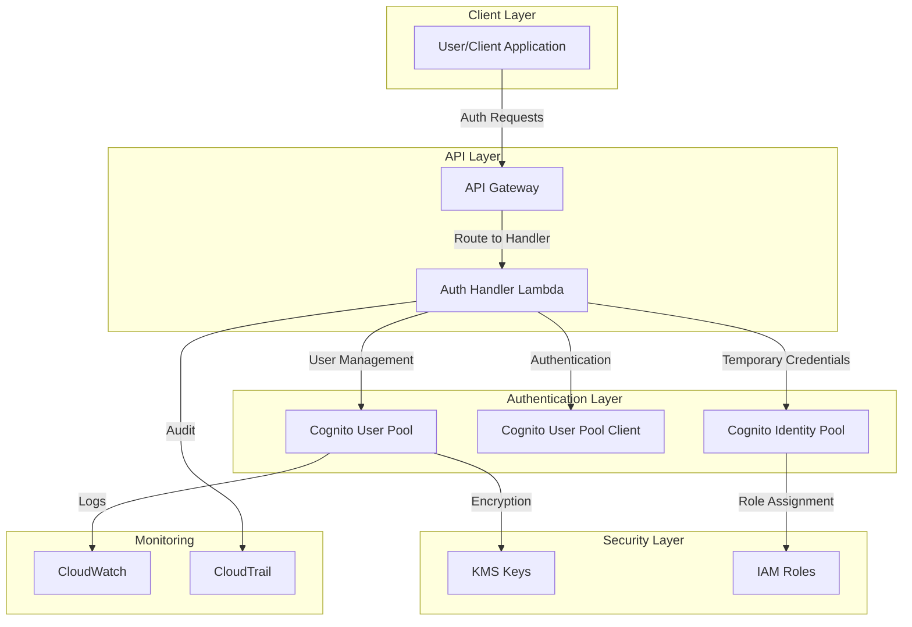

# Amazon Cognito Documentation

## Overview

Amazon Cognito provides the authentication and user management foundation for the Serverless Image Processing Platform. It handles user registration, authentication, password management, and provides secure JWT tokens for API access. Cognito is abstracted behind REST API endpoints, allowing for future flexibility in authentication backends.

## Architecture



## User Pool Configuration

### User Pool Definition
```hcl
resource "aws_cognito_user_pool" "main" {
  name = "${var.project_name}-user-pool"
  
  # Password policy
  password_policy {
    minimum_length    = 8
    require_lowercase = true
    require_numbers   = true
    require_symbols   = true
    require_uppercase = true
    temporary_password_validity_days = 7
  }
  
  # Account recovery settings
  account_recovery_setting {
    recovery_mechanism {
      name     = "verified_email"
      priority = 1
    }
  }
  
  # Email configuration
  email_configuration {
    email_sending_account = "COGNITO_DEFAULT"
  }
  
  # Username attributes
  username_attributes = ["email"]
  
  # Auto verified attributes
  auto_verified_attributes = ["email"]
  
  # MFA configuration
  mfa_configuration = "OFF"
  
  # User pool add-ons
  user_pool_add_ons {
    advanced_security_mode = "ENFORCED"
  }
  
  # Device tracking
  device_configuration {
    challenge_required_on_new_device      = true
    device_only_remembered_on_user_prompt = true
  }
  
  # Email verification message
  email_verification_message = "Your verification code is {####}"
  email_verification_subject = "Your verification code"
  
  # Admin create user config
  admin_create_user_config {
    allow_admin_create_user_only = false
  }
  
  # Lambda triggers
  lambda_config {
    pre_sign_up = aws_lambda_function.pre_sign_up.arn
    post_confirmation = aws_lambda_function.post_confirmation.arn
    pre_authentication = aws_lambda_function.pre_authentication.arn
    post_authentication = aws_lambda_function.post_authentication.arn
  }
  
  # Schema attributes
  schema {
    attribute_data_type = "String"
    name               = "email"
    required           = true
    mutable            = true
    
    string_attribute_constraints {
      min_length = 3
      max_length = 256
    }
  }
  
  schema {
    attribute_data_type = "String"
    name               = "given_name"
    required           = false
    mutable            = true
    
    string_attribute_constraints {
      min_length = 1
      max_length = 256
    }
  }
  
  schema {
    attribute_data_type = "String"
    name               = "family_name"
    required           = false
    mutable            = true
    
    string_attribute_constraints {
      min_length = 1
      max_length = 256
    }
  }
  
  # Tags
  tags = {
    Environment = var.environment
    Service     = "authentication"
  }
}
```

### User Pool Client
```hcl
resource "aws_cognito_user_pool_client" "main" {
  name         = "${var.project_name}-client"
  user_pool_id = aws_cognito_user_pool.main.id
  
  # Generate client secret
  generate_secret = true
  
  # Explicit auth flows
  explicit_auth_flows = [
    "ALLOW_USER_PASSWORD_AUTH",
    "ALLOW_REFRESH_TOKEN_AUTH",
    "ALLOW_USER_SRP_AUTH"
  ]
  
  # OAuth flows
  allowed_oauth_flows = ["code", "implicit"]
  allowed_oauth_flows_user_pool_client = true
  
  # OAuth scopes
  allowed_oauth_scopes = ["email", "openid", "profile"]
  
  # Callback URLs
  callback_urls = [
    "https://your-domain.com/callback",
    "http://localhost:3000/callback"
  ]
  
  # Logout URLs
  logout_urls = [
    "https://your-domain.com/logout",
    "http://localhost:3000/logout"
  ]
  
  # Supported identity providers
  supported_identity_providers = ["COGNITO"]
  
  # Token validity
  access_token_validity = 1
  id_token_validity     = 1
  refresh_token_validity = 30
  
  # Prevent user existence errors
  prevent_user_existence_errors = "ENABLED"
  
  # Read and write attributes
  read_attributes = [
    "email",
    "email_verified",
    "given_name",
    "family_name",
    "updated_at"
  ]
  
  write_attributes = [
    "email",
    "given_name",
    "family_name"
  ]
}
```

### Identity Pool (Optional)
```hcl
resource "aws_cognito_identity_pool" "main" {
  identity_pool_name = "${var.project_name}-identity-pool"
  
  # Allow unauthenticated identities
  allow_unauthenticated_identities = false
  
  # Cognito identity providers
  cognito_identity_providers {
    client_id               = aws_cognito_user_pool_client.main.id
    provider_name           = aws_cognito_user_pool.main.endpoint
    server_side_token_check = false
  }
  
  # Tags
  tags = {
    Environment = var.environment
    Service     = "authentication"
  }
}

resource "aws_iam_role" "authenticated" {
  name = "${var.project_name}-cognito-authenticated-role"

  assume_role_policy = jsonencode({
    Version = "2012-10-17"
    Statement = [
      {
        Action = "sts:AssumeRoleWithWebIdentity"
        Effect = "Allow"
        Principal = {
          Federated = "cognito-identity.amazonaws.com"
        }
        Condition = {
          StringEquals = {
            "cognito-identity.amazonaws.com:aud" = aws_cognito_identity_pool.main.id
          }
          "ForAnyValue:StringLike" = {
            "cognito-identity.amazonaws.com:amr" = "authenticated"
          }
        }
      }
    ]
  })
}

resource "aws_iam_role_policy" "authenticated" {
  name = "${var.project_name}-authenticated-policy"
  role = aws_iam_role.authenticated.id

  policy = jsonencode({
    Version = "2012-10-17"
    Statement = [
      {
        Effect = "Allow"
        Action = [
          "s3:GetObject",
          "s3:PutObject",
          "s3:DeleteObject"
        ]
        Resource = [
          "${aws_s3_bucket.input_bucket.arn}/uploads/${cognito-identity.amazonaws.com:sub}/*",
          "${aws_s3_bucket.output_bucket.arn}/processed/${cognito-identity.amazonaws.com:sub}/*"
        ]
      }
    ]
  })
}

resource "aws_cognito_identity_pool_roles_attachment" "main" {
  identity_pool_id = aws_cognito_identity_pool.main.id

  roles = {
    "authenticated" = aws_iam_role.authenticated.arn
  }
}
```

## Authentication Flows

### User Registration
```python
import boto3
import json
import os
from datetime import datetime

def register_user(email, password, given_name=None, family_name=None):
    """Register a new user in Cognito"""
    cognito_client = boto3.client('cognito-idp')
    
    try:
        # Prepare user attributes
        user_attributes = [
            {
                'Name': 'email',
                'Value': email
            }
        ]
        
        if given_name:
            user_attributes.append({
                'Name': 'given_name',
                'Value': given_name
            })
        
        if family_name:
            user_attributes.append({
                'Name': 'family_name',
                'Value': family_name
            })
        
        # Sign up user
        response = cognito_client.sign_up(
            ClientId=os.environ['COGNITO_CLIENT_ID'],
            Username=email,
            Password=password,
            UserAttributes=user_attributes
        )
        
        return {
            'success': True,
            'userSub': response['UserSub'],
            'message': 'User registered successfully. Please check your email for verification code.'
        }
        
    except cognito_client.exceptions.UsernameExistsException:
        return {
            'success': False,
            'error': 'User already exists'
        }
    except cognito_client.exceptions.InvalidPasswordException as e:
        return {
            'success': False,
            'error': f'Invalid password: {str(e)}'
        }
    except Exception as e:
        return {
            'success': False,
            'error': f'Registration failed: {str(e)}'
        }

def lambda_handler(event, context):
    """Auth Handler Lambda - Registration endpoint"""
    try:
        # Parse request body
        body = json.loads(event.get('body', '{}'))
        email = body.get('email')
        password = body.get('password')
        given_name = body.get('givenName')
        family_name = body.get('familyName')
        
        # Validate input
        if not email or not password:
            return {
                'statusCode': 400,
                'headers': {
                    'Content-Type': 'application/json',
                    'Access-Control-Allow-Origin': '*'
                },
                'body': json.dumps({
                    'error': 'Email and password are required'
                })
            }
        
        # Register user
        result = register_user(email, password, given_name, family_name)
        
        if result['success']:
            return {
                'statusCode': 200,
                'headers': {
                    'Content-Type': 'application/json',
                    'Access-Control-Allow-Origin': '*'
                },
                'body': json.dumps({
                    'message': result['message'],
                    'userSub': result['userSub']
                })
            }
        else:
            return {
                'statusCode': 400,
                'headers': {
                    'Content-Type': 'application/json',
                    'Access-Control-Allow-Origin': '*'
                },
                'body': json.dumps({
                    'error': result['error']
                })
            }
            
    except Exception as e:
        return {
            'statusCode': 500,
            'headers': {
                'Content-Type': 'application/json',
                'Access-Control-Allow-Origin': '*'
            },
            'body': json.dumps({
                'error': f'Internal server error: {str(e)}'
            })
        }
```

### User Authentication
```python
def authenticate_user(email, password):
    """Authenticate user and return tokens"""
    cognito_client = boto3.client('cognito-idp')
    
    try:
        # Initiate auth
        response = cognito_client.initiate_auth(
            ClientId=os.environ['COGNITO_CLIENT_ID'],
            AuthFlow='USER_PASSWORD_AUTH',
            AuthParameters={
                'USERNAME': email,
                'PASSWORD': password
            }
        )
        
        # Check if challenge is required
        if 'ChallengeName' in response:
            if response['ChallengeName'] == 'NEW_PASSWORD_REQUIRED':
                return {
                    'success': False,
                    'challenge': 'NEW_PASSWORD_REQUIRED',
                    'session': response['Session']
                }
            elif response['ChallengeName'] == 'SMS_MFA':
                return {
                    'success': False,
                    'challenge': 'SMS_MFA',
                    'session': response['Session']
                }
        
        # Authentication successful
        return {
            'success': True,
            'tokens': {
                'accessToken': response['AuthenticationResult']['AccessToken'],
                'refreshToken': response['AuthenticationResult']['RefreshToken'],
                'idToken': response['AuthenticationResult']['IdToken'],
                'expiresIn': response['AuthenticationResult']['ExpiresIn']
            }
        }
        
    except cognito_client.exceptions.NotAuthorizedException:
        return {
            'success': False,
            'error': 'Invalid credentials'
        }
    except cognito_client.exceptions.UserNotConfirmedException:
        return {
            'success': False,
            'error': 'User not confirmed'
        }
    except Exception as e:
        return {
            'success': False,
            'error': f'Authentication failed: {str(e)}'
        }

def lambda_handler(event, context):
    """Auth Handler Lambda - Sign in endpoint"""
    try:
        # Parse request body
        body = json.loads(event.get('body', '{}'))
        email = body.get('email')
        password = body.get('password')
        
        # Validate input
        if not email or not password:
            return {
                'statusCode': 400,
                'headers': {
                    'Content-Type': 'application/json',
                    'Access-Control-Allow-Origin': '*'
                },
                'body': json.dumps({
                    'error': 'Email and password are required'
                })
            }
        
        # Authenticate user
        result = authenticate_user(email, password)
        
        if result['success']:
            return {
                'statusCode': 200,
                'headers': {
                    'Content-Type': 'application/json',
                    'Access-Control-Allow-Origin': '*'
                },
                'body': json.dumps({
                    'message': 'Sign in successful',
                    'tokens': result['tokens']
                })
            }
        else:
            return {
                'statusCode': 401,
                'headers': {
                    'Content-Type': 'application/json',
                    'Access-Control-Allow-Origin': '*'
                },
                'body': json.dumps({
                    'error': result['error']
                })
            }
            
    except Exception as e:
        return {
            'statusCode': 500,
            'headers': {
                'Content-Type': 'application/json',
                'Access-Control-Allow-Origin': '*'
            },
            'body': json.dumps({
                'error': f'Internal server error: {str(e)}'
            })
        }
```

### Token Validation
```python
import jwt
import requests

def validate_token(token):
    """Validate JWT token from Cognito"""
    try:
        # Get Cognito public keys
        region = os.environ['AWS_REGION']
        user_pool_id = os.environ['COGNITO_USER_POOL_ID']
        
        keys_url = f"https://cognito-idp.{region}.amazonaws.com/{user_pool_id}/.well-known/jwks.json"
        response = requests.get(keys_url)
        keys = response.json()['keys']
        
        # Decode token header to get key ID
        header = jwt.get_unverified_header(token)
        key_id = header['kid']
        
        # Find the correct key
        public_key = None
        for key in keys:
            if key['kid'] == key_id:
                public_key = jwt.algorithms.RSAAlgorithm.from_jwk(json.dumps(key))
                break
        
        if not public_key:
            raise Exception('Public key not found')
        
        # Verify and decode token
        payload = jwt.decode(
            token,
            public_key,
            algorithms=['RS256'],
            audience=os.environ['COGNITO_CLIENT_ID'],
            issuer=f"https://cognito-idp.{region}.amazonaws.com/{user_pool_id}"
        )
        
        return {
            'valid': True,
            'payload': payload
        }
        
    except jwt.ExpiredSignatureError:
        return {
            'valid': False,
            'error': 'Token expired'
        }
    except jwt.InvalidTokenError as e:
        return {
            'valid': False,
            'error': f'Invalid token: {str(e)}'
        }
    except Exception as e:
        return {
            'valid': False,
            'error': f'Token validation failed: {str(e)}'
        }

def get_user_from_token(token):
    """Extract user information from validated token"""
    validation_result = validate_token(token)
    
    if not validation_result['valid']:
        return None
    
    payload = validation_result['payload']
    
    return {
        'userId': payload['sub'],
        'email': payload.get('email'),
        'givenName': payload.get('given_name'),
        'familyName': payload.get('family_name'),
        'emailVerified': payload.get('email_verified', False)
    }
```

## Lambda Triggers

### Pre-Sign Up Trigger
```python
def lambda_handler(event, context):
    """Pre-sign up Lambda trigger"""
    try:
        # Get user attributes
        user_attributes = event['request']['userAttributes']
        email = user_attributes.get('email', '')
        
        # Validate email domain (optional)
        allowed_domains = ['example.com', 'company.com']
        email_domain = email.split('@')[-1] if '@' in email else ''
        
        if email_domain not in allowed_domains:
            raise Exception(f'Email domain {email_domain} is not allowed')
        
        # Auto confirm and auto verify
        event['response']['autoConfirmUser'] = True
        event['response']['autoVerifyEmail'] = True
        
        return event
        
    except Exception as e:
        # Reject the sign up
        raise Exception(f'Sign up rejected: {str(e)}')
```

### Post Confirmation Trigger
```python
import boto3
import json
from datetime import datetime

def lambda_handler(event, context):
    """Post confirmation Lambda trigger"""
    try:
        # Get user information
        user_attributes = event['request']['userAttributes']
        user_id = event['request']['userAttributes']['sub']
        email = user_attributes.get('email', '')
        given_name = user_attributes.get('given_name', '')
        family_name = user_attributes.get('family_name', '')
        
        # Create user profile in DynamoDB
        dynamodb = boto3.resource('dynamodb')
        table = dynamodb.Table(os.environ['DYNAMODB_TABLE'])
        
        user_profile = {
            'imageId': 'user_profile',
            'userId': user_id,
            'email': email,
            'profile': {
                'firstName': given_name,
                'lastName': family_name,
                'preferences': {
                    'defaultImageSize': 'medium',
                    'watermarkEnabled': False,
                    'watermarkText': ''
                }
            },
            'statistics': {
                'totalImages': 0,
                'totalStorageUsed': 0,
                'lastUploadAt': None
            },
            'createdAt': datetime.utcnow().isoformat(),
            'updatedAt': datetime.utcnow().isoformat()
        }
        
        table.put_item(Item=user_profile)
        
        # Send welcome email (optional)
        sns_client = boto3.client('sns')
        sns_client.publish(
            TopicArn=os.environ['SNS_TOPIC_ARN'],
            Subject='Welcome to Image Processing Platform',
            Message=json.dumps({
                'type': 'welcome_email',
                'userId': user_id,
                'email': email,
                'timestamp': datetime.utcnow().isoformat()
            })
        )
        
        return event
        
    except Exception as e:
        print(f'Error in post confirmation: {e}')
        # Don't fail the confirmation process
        return event
```

### Pre Authentication Trigger
```python
def lambda_handler(event, context):
    """Pre authentication Lambda trigger"""
    try:
        # Get user information
        user_attributes = event['request']['userAttributes']
        user_id = user_attributes['sub']
        
        # Check if user is blocked (optional)
        # This could check against a blacklist or other criteria
        
        # Log authentication attempt
        print(f'Authentication attempt for user: {user_id}')
        
        return event
        
    except Exception as e:
        print(f'Error in pre authentication: {e}')
        return event
```

### Post Authentication Trigger
```python
import boto3
from datetime import datetime

def lambda_handler(event, context):
    """Post authentication Lambda trigger"""
    try:
        # Get user information
        user_attributes = event['request']['userAttributes']
        user_id = user_attributes['sub']
        
        # Update last login time in DynamoDB
        dynamodb = boto3.resource('dynamodb')
        table = dynamodb.Table(os.environ['DYNAMODB_TABLE'])
        
        table.update_item(
            Key={
                'imageId': 'user_profile',
                'userId': user_id
            },
            UpdateExpression='SET profile.lastLoginAt = :lastLoginAt, updatedAt = :updatedAt',
            ExpressionAttributeValues={
                ':lastLoginAt': datetime.utcnow().isoformat(),
                ':updatedAt': datetime.utcnow().isoformat()
            }
        )
        
        # Log successful authentication
        print(f'Successful authentication for user: {user_id}')
        
        return event
        
    except Exception as e:
        print(f'Error in post authentication: {e}')
        return event
```

## Security Features

### Advanced Security Mode
```hcl
resource "aws_cognito_user_pool" "main" {
  # ... other configuration ...
  
  user_pool_add_ons {
    advanced_security_mode = "ENFORCED"
  }
}
```

### Risk-Based Adaptive Authentication
```python
def lambda_handler(event, context):
    """Risk-based adaptive authentication"""
    try:
        # Get user information
        user_attributes = event['request']['userAttributes']
        user_id = user_attributes['sub']
        
        # Get risk assessment
        risk_level = assess_user_risk(user_id, event)
        
        if risk_level == 'HIGH':
            # Require additional verification
            event['response']['issueTokens'] = False
            event['response']['failAuthentication'] = True
            event['response']['challengeName'] = 'CUSTOM_CHALLENGE'
        elif risk_level == 'MEDIUM':
            # Require MFA
            event['response']['issueTokens'] = False
            event['response']['failAuthentication'] = False
            event['response']['challengeName'] = 'SMS_MFA'
        else:
            # Allow normal authentication
            event['response']['issueTokens'] = True
            event['response']['failAuthentication'] = False
        
        return event
        
    except Exception as e:
        print(f'Error in risk assessment: {e}')
        return event

def assess_user_risk(user_id, event):
    """Assess user risk based on various factors"""
    # This is a simplified example
    # In production, you would implement more sophisticated risk assessment
    
    risk_factors = []
    
    # Check login time
    current_hour = datetime.utcnow().hour
    if current_hour < 6 or current_hour > 22:
        risk_factors.append('unusual_time')
    
    # Check location (if available)
    # Check device fingerprint
    # Check previous login patterns
    
    if len(risk_factors) >= 2:
        return 'HIGH'
    elif len(risk_factors) == 1:
        return 'MEDIUM'
    else:
        return 'LOW'
```

## Monitoring & Alerting

### CloudWatch Metrics
```python
import boto3
from datetime import datetime, timedelta

def get_cognito_metrics():
    """Get Cognito metrics from CloudWatch"""
    cloudwatch = boto3.client('cloudwatch')
    
    metrics = [
        'SignUpSuccesses',
        'SignUpFailures',
        'SignInSuccesses',
        'SignInFailures',
        'ForgotPasswordRequests',
        'ForgotPasswordSuccesses',
        'ForgotPasswordFailures',
        'TokenRefreshSuccesses',
        'TokenRefreshFailures'
    ]
    
    for metric in metrics:
        response = cloudwatch.get_metric_statistics(
            Namespace='AWS/Cognito',
            MetricName=metric,
            Dimensions=[
                {
                    'Name': 'UserPool',
                    'Value': os.environ['COGNITO_USER_POOL_ID']
                }
            ],
            StartTime=datetime.utcnow() - timedelta(hours=1),
            EndTime=datetime.utcnow(),
            Period=300,
            Statistics=['Sum', 'Average', 'Maximum']
        )
        print(f"{metric}: {response['Datapoints']}")
```

### CloudWatch Alarms
```hcl
resource "aws_cloudwatch_metric_alarm" "cognito_sign_in_failures" {
  alarm_name          = "cognito-sign-in-failures"
  comparison_operator = "GreaterThanThreshold"
  evaluation_periods  = "2"
  metric_name         = "SignInFailures"
  namespace           = "AWS/Cognito"
  period              = "300"
  statistic           = "Sum"
  threshold           = "10"
  alarm_description   = "This metric monitors Cognito sign-in failures"
  
  dimensions = {
    UserPool = aws_cognito_user_pool.main.id
  }
}

resource "aws_cloudwatch_metric_alarm" "cognito_sign_up_failures" {
  alarm_name          = "cognito-sign-up-failures"
  comparison_operator = "GreaterThanThreshold"
  evaluation_periods  = "2"
  metric_name         = "SignUpFailures"
  namespace           = "AWS/Cognito"
  period              = "300"
  statistic           = "Sum"
  threshold           = "5"
  alarm_description   = "This metric monitors Cognito sign-up failures"
  
  dimensions = {
    UserPool = aws_cognito_user_pool.main.id
  }
}
```

## Best Practices

### 1. Security
- **Password Policy**: Enforce strong password requirements
- **MFA**: Enable multi-factor authentication for sensitive operations
- **Advanced Security**: Use advanced security mode for risk-based authentication
- **Token Management**: Implement proper token validation and refresh

### 2. User Experience
- **Email Verification**: Require email verification for security
- **Password Reset**: Implement secure password reset flow
- **Account Recovery**: Provide multiple account recovery options
- **Error Messages**: Provide clear, user-friendly error messages

### 3. Performance
- **Token Caching**: Cache validated tokens to reduce validation overhead
- **Connection Pooling**: Use connection pooling for database operations
- **Async Operations**: Use async operations for non-critical tasks
- **Monitoring**: Monitor authentication performance metrics

### 4. Compliance
- **Data Protection**: Ensure compliance with data protection regulations
- **Audit Logging**: Implement comprehensive audit logging
- **Data Retention**: Configure appropriate data retention policies
- **Privacy Controls**: Implement privacy controls for user data

### 5. Integration
- **API Abstraction**: Abstract Cognito behind REST API endpoints
- **Error Handling**: Implement comprehensive error handling
- **Testing**: Test authentication flows thoroughly
- **Documentation**: Document authentication APIs and flows

## Troubleshooting

### Common Issues

#### 1. Authentication Failures
**Symptoms**: High sign-in failure rate
**Solutions**:
- Check password policy requirements
- Verify user confirmation status
- Review Lambda trigger errors
- Check IAM permissions

#### 2. Token Validation Issues
**Symptoms**: Token validation failures
**Solutions**:
- Verify token expiration times
- Check audience and issuer claims
- Validate public key configuration
- Review token format

#### 3. User Registration Issues
**Symptoms**: Sign-up failures
**Solutions**:
- Check email verification settings
- Review Lambda trigger configurations
- Verify user pool client settings
- Check for duplicate usernames

#### 4. Performance Issues
**Symptoms**: Slow authentication
**Solutions**:
- Optimize Lambda trigger functions
- Implement token caching
- Review database query performance
- Monitor CloudWatch metrics

This Cognito implementation provides a robust, secure, and scalable authentication solution for the Serverless Image Processing Platform, with comprehensive security features, monitoring, and integration capabilities. 