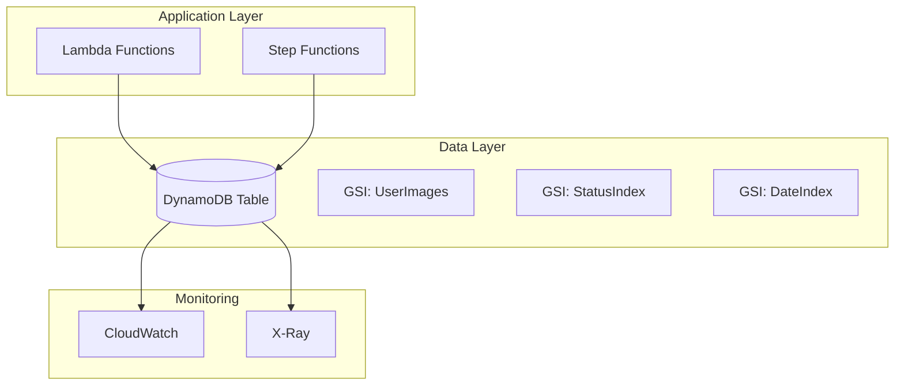

# DynamoDB Documentation

## Overview

DynamoDB serves as the primary metadata store for the Serverless Image Processing Platform, storing user information, image metadata, processing status, and audit trails. It provides high availability, scalability, and consistent performance for the application's data requirements.

## Architecture



## Data Model

### Primary Table: `image-processing-metadata`

#### Table Schema
```json
{
  "TableName": "image-processing-metadata",
  "KeySchema": [
    {
      "AttributeName": "imageId",
      "KeyType": "HASH"
    },
    {
      "AttributeName": "userId",
      "KeyType": "RANGE"
    }
  ],
  "AttributeDefinitions": [
    {
      "AttributeName": "imageId",
      "AttributeType": "S"
    },
    {
      "AttributeName": "userId",
      "AttributeType": "S"
    },
    {
      "AttributeName": "status",
      "AttributeType": "S"
    },
    {
      "AttributeName": "createdAt",
      "AttributeType": "S"
    },
    {
      "AttributeName": "processedAt",
      "AttributeType": "S"
    }
  ],
  "GlobalSecondaryIndexes": [
    {
      "IndexName": "UserImages",
      "KeySchema": [
        {
          "AttributeName": "userId",
          "KeyType": "HASH"
        },
        {
          "AttributeName": "createdAt",
          "KeyType": "RANGE"
        }
      ],
      "Projection": {
        "ProjectionType": "ALL"
      }
    },
    {
      "IndexName": "StatusIndex",
      "KeySchema": [
        {
          "AttributeName": "status",
          "KeyType": "HASH"
        },
        {
          "AttributeName": "createdAt",
          "KeyType": "RANGE"
        }
      ],
      "Projection": {
        "ProjectionType": "ALL"
      }
    },
    {
      "IndexName": "DateIndex",
      "KeySchema": [
        {
          "AttributeName": "createdAt",
          "KeyType": "HASH"
        },
        {
          "AttributeName": "imageId",
          "KeyType": "RANGE"
        }
      ],
      "Projection": {
        "ProjectionType": "ALL"
      }
    }
  ]
}
```

### Item Structure

#### Image Metadata Item
```json
{
  "imageId": "img_1234567890abcdef",
  "userId": "user_12345678-1234-1234-1234-123456789012",
  "originalFileName": "vacation-photo.jpg",
  "originalFileSize": 2048576,
  "originalFileType": "image/jpeg",
  "originalS3Key": "uploads/user_12345678-1234-1234-1234-123456789012/img_1234567890abcdef.jpg",
  "processedS3Key": "processed/user_12345678-1234-1234-1234-123456789012/img_1234567890abcdef.jpg",
  "status": "completed",
  "processingSteps": {
    "validation": {
      "status": "completed",
      "startedAt": "2024-01-01T12:00:00Z",
      "completedAt": "2024-01-01T12:00:05Z",
      "result": "valid"
    },
    "resize": {
      "status": "completed",
      "startedAt": "2024-01-01T12:00:05Z",
      "completedAt": "2024-01-01T12:00:15Z",
      "dimensions": {
        "original": {"width": 1920, "height": 1080},
        "processed": {"width": 800, "height": 600}
      }
    },
    "watermark": {
      "status": "completed",
      "startedAt": "2024-01-01T12:00:15Z",
      "completedAt": "2024-01-01T12:00:20Z",
      "watermarkType": "text",
      "watermarkText": "Processed by Image Platform"
    }
  },
  "createdAt": "2024-01-01T12:00:00Z",
  "updatedAt": "2024-01-01T12:00:20Z",
  "processedAt": "2024-01-01T12:00:20Z",
  "ttl": 1735689600,
  "tags": ["vacation", "family"],
  "metadata": {
    "camera": "iPhone 12",
    "location": "Beach Resort",
    "description": "Family vacation photo"
  }
}
```

#### User Profile Item
```json
{
  "imageId": "user_profile",
  "userId": "user_12345678-1234-1234-1234-123456789012",
  "email": "user@example.com",
  "profile": {
    "firstName": "John",
    "lastName": "Doe",
    "avatar": "avatars/user_12345678-1234-1234-1234-123456789012.jpg",
    "preferences": {
      "defaultImageSize": "medium",
      "watermarkEnabled": true,
      "watermarkText": "John's Photos"
    }
  },
  "statistics": {
    "totalImages": 150,
    "totalStorageUsed": 1073741824,
    "lastUploadAt": "2024-01-01T12:00:00Z"
  },
  "createdAt": "2024-01-01T10:00:00Z",
  "updatedAt": "2024-01-01T12:00:00Z",
  "ttl": 1735689600
}
```

## Access Patterns

### 1. Get Image by ID
**Query**: Retrieve specific image metadata
```python
def get_image_by_id(image_id, user_id):
    response = table.get_item(
        Key={
            'imageId': image_id,
            'userId': user_id
        }
    )
    return response.get('Item')
```

### 2. Get User's Images
**Query**: Retrieve all images for a specific user
```python
def get_user_images(user_id, limit=20, last_evaluated_key=None):
    response = table.query(
        IndexName='UserImages',
        KeyConditionExpression='userId = :userId',
        ExpressionAttributeValues={
            ':userId': user_id
        },
        ScanIndexForward=False,  # Most recent first
        Limit=limit,
        ExclusiveStartKey=last_evaluated_key
    )
    return response
```

### 3. Get Images by Status
**Query**: Retrieve images with specific processing status
```python
def get_images_by_status(status, limit=20, last_evaluated_key=None):
    response = table.query(
        IndexName='StatusIndex',
        KeyConditionExpression='status = :status',
        ExpressionAttributeValues={
            ':status': status
        },
        ScanIndexForward=False,
        Limit=limit,
        ExclusiveStartKey=last_evaluated_key
    )
    return response
```

### 4. Get Recent Images
**Query**: Retrieve recently created images
```python
def get_recent_images(limit=20, last_evaluated_key=None):
    response = table.query(
        IndexName='DateIndex',
        KeyConditionExpression='begins_with(createdAt, :date_prefix)',
        ExpressionAttributeValues={
            ':date_prefix': '2024-01-01'
        },
        ScanIndexForward=False,
        Limit=limit,
        ExclusiveStartKey=last_evaluated_key
    )
    return response
```

### 5. Update Image Status
**Update**: Update processing status and metadata
```python
def update_image_status(image_id, user_id, status, step_data=None):
    update_expression = 'SET #status = :status, updatedAt = :updatedAt'
    expression_attrs = {
        '#status': 'status',
        ':status': status,
        ':updatedAt': datetime.utcnow().isoformat()
    }
    
    if step_data:
        update_expression += ', processingSteps.#step = :stepData'
        expression_attrs['#step'] = step_data['step']
        expression_attrs[':stepData'] = step_data['data']
    
    if status == 'completed':
        update_expression += ', processedAt = :processedAt'
        expression_attrs[':processedAt'] = datetime.utcnow().isoformat()
    
    response = table.update_item(
        Key={
            'imageId': image_id,
            'userId': user_id
        },
        UpdateExpression=update_expression,
        ExpressionAttributeNames=expression_attrs.get('names', {}),
        ExpressionAttributeValues=expression_attrs
    )
    return response
```

## Performance Optimization

### Read Capacity Optimization

#### 1. Consistent Reads vs Eventually Consistent Reads
```python
# Use eventually consistent reads for better performance
def get_image_metadata(image_id, user_id):
    response = table.get_item(
        Key={
            'imageId': image_id,
            'userId': user_id
        },
        ConsistentRead=False  # Eventually consistent for better performance
    )
    return response.get('Item')
```

#### 2. Batch Operations
```python
def batch_get_images(image_keys):
    response = dynamodb.batch_get_item(
        RequestItems={
            table_name: {
                'Keys': image_keys,
                'ConsistentRead': False
            }
        }
    )
    return response['Responses'][table_name]
```

### Write Capacity Optimization

#### 1. Conditional Writes
```python
def update_image_only_if_exists(image_id, user_id, updates):
    response = table.update_item(
        Key={
            'imageId': image_id,
            'userId': user_id
        },
        UpdateExpression='SET #attr = :value',
        ConditionExpression='attribute_exists(imageId)',
        ExpressionAttributeNames={'#attr': 'status'},
        ExpressionAttributeValues={':value': updates['status']}
    )
    return response
```

#### 2. Batch Writes
```python
def batch_write_images(image_items):
    with table.batch_writer() as batch:
        for item in image_items:
            batch.put_item(Item=item)
```

### Index Optimization

#### 1. Sparse Indexes
```python
# Only index items with specific attributes
def create_sparse_index():
    # Only index completed images
    response = table.update_item(
        Key={'imageId': 'img_123', 'userId': 'user_123'},
        UpdateExpression='SET completedAt = :completedAt',
        ExpressionAttributeValues={':completedAt': '2024-01-01T12:00:00Z'}
    )
```

#### 2. Composite Sort Keys
```python
# Use composite sort keys for efficient queries
def create_composite_key():
    # Format: userId#imageId#timestamp
    composite_key = f"{user_id}#{image_id}#{timestamp}"
    return composite_key
```

## Auto-Scaling Configuration

### Read Capacity Auto-Scaling
```hcl
resource "aws_dynamodb_table" "image_metadata" {
  # ... other configuration ...
  
  read_capacity  = 5
  write_capacity = 5
  
  attribute {
    name = "imageId"
    type = "S"
  }
  
  attribute {
    name = "userId"
    type = "S"
  }
  
  global_secondary_index {
    name            = "UserImages"
    hash_key        = "userId"
    range_key       = "createdAt"
    projection_type = "ALL"
    read_capacity   = 5
    write_capacity  = 5
  }
  
  tags = {
    Environment = "production"
    Service     = "image-processing"
  }
}

resource "aws_appautoscaling_target" "dynamodb_table_read_target" {
  max_capacity       = 100
  min_capacity       = 5
  resource_id        = "table/${aws_dynamodb_table.image_metadata.name}"
  scalable_dimension = "dynamodb:table:ReadCapacityUnits"
  service_namespace  = "dynamodb"
}

resource "aws_appautoscaling_policy" "dynamodb_table_read_policy" {
  name               = "DynamoDBReadCapacityUtilization"
  policy_type        = "TargetTrackingScaling"
  resource_id        = aws_appautoscaling_target.dynamodb_table_read_target.resource_id
  scalable_dimension = aws_appautoscaling_target.dynamodb_table_read_target.scalable_dimension
  service_namespace  = aws_appautoscaling_target.dynamodb_table_read_target.service_namespace

  target_tracking_scaling_policy_configuration {
    predefined_metric_specification {
      predefined_metric_type = "DynamoDBReadCapacityUtilization"
    }
    target_value = 70.0
  }
}
```

## Data Lifecycle Management

### TTL (Time To Live)
```python
def set_ttl_for_image(image_id, user_id, ttl_days=30):
    ttl_timestamp = int(time.time()) + (ttl_days * 24 * 60 * 60)
    
    response = table.update_item(
        Key={
            'imageId': image_id,
            'userId': user_id
        },
        UpdateExpression='SET ttl = :ttl',
        ExpressionAttributeValues={
            ':ttl': ttl_timestamp
        }
    )
    return response
```

### Backup Strategy
```python
def create_on_demand_backup():
    response = dynamodb.create_backup(
        TableName=table_name,
        BackupName=f"backup-{datetime.now().strftime('%Y%m%d-%H%M%S')}"
    )
    return response['BackupDetails']
```

## Monitoring & Alerting

### CloudWatch Metrics
```python
def get_dynamodb_metrics():
    metrics = [
        'ConsumedReadCapacityUnits',
        'ConsumedWriteCapacityUnits',
        'ProvisionedReadCapacityUnits',
        'ProvisionedWriteCapacityUnits',
        'ReadThrottleEvents',
        'WriteThrottleEvents',
        'UserErrors',
        'SystemErrors'
    ]
    
    for metric in metrics:
        response = cloudwatch.get_metric_statistics(
            Namespace='AWS/DynamoDB',
            MetricName=metric,
            Dimensions=[
                {
                    'Name': 'TableName',
                    'Value': table_name
                }
            ],
            StartTime=datetime.utcnow() - timedelta(hours=1),
            EndTime=datetime.utcnow(),
            Period=300,
            Statistics=['Sum', 'Average', 'Maximum']
        )
        print(f"{metric}: {response['Datapoints']}")
```

### CloudWatch Alarms
```hcl
resource "aws_cloudwatch_metric_alarm" "dynamodb_read_throttles" {
  alarm_name          = "dynamodb-read-throttles"
  comparison_operator = "GreaterThanThreshold"
  evaluation_periods  = "2"
  metric_name         = "ReadThrottleEvents"
  namespace           = "AWS/DynamoDB"
  period              = "300"
  statistic           = "Sum"
  threshold           = "10"
  alarm_description   = "This metric monitors DynamoDB read throttle events"
  
  dimensions = {
    TableName = aws_dynamodb_table.image_metadata.name
  }
}

resource "aws_cloudwatch_metric_alarm" "dynamodb_write_throttles" {
  alarm_name          = "dynamodb-write-throttles"
  comparison_operator = "GreaterThanThreshold"
  evaluation_periods  = "2"
  metric_name         = "WriteThrottleEvents"
  namespace           = "AWS/DynamoDB"
  period              = "300"
  statistic           = "Sum"
  threshold           = "10"
  alarm_description   = "This metric monitors DynamoDB write throttle events"
  
  dimensions = {
    TableName = aws_dynamodb_table.image_metadata.name
  }
}
```

## Security

### Encryption
- **Encryption at Rest**: AES-256 encryption using AWS KMS
- **Encryption in Transit**: TLS 1.2+ for all communications
- **Key Rotation**: Automatic key rotation every 365 days

### Access Control
```python
# IAM Policy for Lambda functions
{
  "Version": "2012-10-17",
  "Statement": [
    {
      "Effect": "Allow",
      "Action": [
        "dynamodb:GetItem",
        "dynamodb:PutItem",
        "dynamodb:UpdateItem",
        "dynamodb:DeleteItem",
        "dynamodb:Query",
        "dynamodb:Scan"
      ],
      "Resource": [
        "arn:aws:dynamodb:region:account:table/image-processing-metadata",
        "arn:aws:dynamodb:region:account:table/image-processing-metadata/index/*"
      ],
      "Condition": {
        "StringEquals": {
          "dynamodb:LeadingKeys": ["${cognito-identity.amazonaws.com:sub}"]
        }
      }
    }
  ]
}
```

## Best Practices

### 1. Design for Scale
- Use composite keys for efficient queries
- Implement proper indexing strategy
- Use batch operations for bulk data

### 2. Optimize for Cost
- Use on-demand capacity for unpredictable workloads
- Implement TTL for automatic data cleanup
- Use sparse indexes to reduce storage costs

### 3. Ensure Reliability
- Implement retry logic with exponential backoff
- Use conditional writes for data consistency
- Monitor and alert on throttling events

### 4. Security
- Use least-privilege IAM policies
- Enable encryption at rest and in transit
- Implement proper access controls

### 5. Monitoring
- Set up comprehensive CloudWatch alarms
- Monitor capacity utilization
- Track error rates and throttling events

## Troubleshooting

### Common Issues

#### 1. Throttling
**Symptoms**: ReadThrottleEvents or WriteThrottleEvents metrics increase
**Solutions**:
- Increase provisioned capacity
- Implement exponential backoff in application code
- Use batch operations to reduce request frequency

#### 2. Hot Partitions
**Symptoms**: Uneven capacity utilization across partitions
**Solutions**:
- Redesign partition key strategy
- Use composite keys for better distribution
- Implement sharding for high-traffic items

#### 3. High Latency
**Symptoms**: Slow query performance
**Solutions**:
- Use appropriate indexes
- Optimize query patterns
- Consider caching frequently accessed data

#### 4. Cost Optimization
**Symptoms**: High DynamoDB costs
**Solutions**:
- Use on-demand capacity for variable workloads
- Implement TTL for automatic cleanup
- Optimize item sizes and indexes

This DynamoDB implementation provides a robust, scalable, and cost-efficient metadata store for the Serverless Image Processing Platform, with comprehensive monitoring, security, and performance optimization features.
