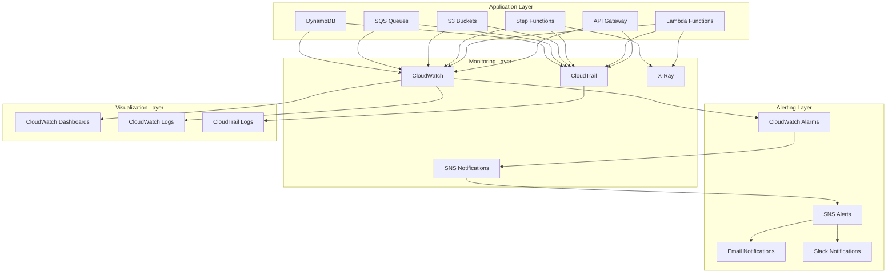

# Monitoring & Observability Documentation

## Overview

The Serverless Image Processing Platform implements a comprehensive monitoring and observability strategy using AWS CloudWatch, CloudTrail, SNS notifications, and X-Ray distributed tracing. This multi-layered approach provides real-time visibility into system performance, security events, and operational health.

## Architecture



## CloudWatch Configuration

### CloudWatch Log Groups
```hcl
resource "aws_cloudwatch_log_group" "lambda_logs" {
  for_each = toset([
    "auth-handler",
    "upload-handler", 
    "s3-event-handler",
    "orchestrator",
    "validation",
    "resize",
    "watermark",
    "error-handler",
    "cleanup"
  ])
  
  name              = "/aws/lambda/${var.project_name}-${each.key}"
  retention_in_days = 30
  
  tags = {
    Environment = var.environment
    Service     = "lambda"
    Function    = each.key
  }
}

resource "aws_cloudwatch_log_group" "api_gateway" {
  name              = "/aws/apigateway/${var.project_name}-api"
  retention_in_days = 30
  
  tags = {
    Environment = var.environment
    Service     = "api-gateway"
  }
}

resource "aws_cloudwatch_log_group" "step_functions" {
  name              = "/aws/states/${var.project_name}-image-processing"
  retention_in_days = 30
  
  tags = {
    Environment = var.environment
    Service     = "step-functions"
  }
}

resource "aws_cloudwatch_log_group" "vpc_flow_logs" {
  name              = "/aws/vpc/flowlogs"
  retention_in_days = 30
  
  tags = {
    Environment = var.environment
    Service     = "vpc"
  }
}
```

### CloudWatch Alarms

#### Lambda Function Alarms
```hcl
resource "aws_cloudwatch_metric_alarm" "lambda_errors" {
  for_each = toset([
    "auth-handler",
    "upload-handler",
    "s3-event-handler", 
    "orchestrator",
    "validation",
    "resize",
    "watermark"
  ])
  
  alarm_name          = "${var.project_name}-${each.key}-errors"
  comparison_operator = "GreaterThanThreshold"
  evaluation_periods  = "2"
  metric_name         = "Errors"
  namespace           = "AWS/Lambda"
  period              = "300"
  statistic           = "Sum"
  threshold           = "5"
  alarm_description   = "This metric monitors Lambda function errors"
  
  dimensions = {
    FunctionName = aws_lambda_function.lambda_functions[each.key].function_name
  }
  
  alarm_actions = [aws_sns_topic.alerts.arn]
  ok_actions    = [aws_sns_topic.alerts.arn]
}

resource "aws_cloudwatch_metric_alarm" "lambda_duration" {
  for_each = toset([
    "auth-handler",
    "upload-handler",
    "s3-event-handler",
    "orchestrator",
    "validation",
    "resize",
    "watermark"
  ])
  
  alarm_name          = "${var.project_name}-${each.key}-duration"
  comparison_operator = "GreaterThanThreshold"
  evaluation_periods  = "2"
  metric_name         = "Duration"
  namespace           = "AWS/Lambda"
  period              = "300"
  statistic           = "Average"
  threshold           = "30000"  # 30 seconds
  alarm_description   = "This metric monitors Lambda function duration"
  
  dimensions = {
    FunctionName = aws_lambda_function.lambda_functions[each.key].function_name
  }
  
  alarm_actions = [aws_sns_topic.alerts.arn]
  ok_actions    = [aws_sns_topic.alerts.arn]
}

resource "aws_cloudwatch_metric_alarm" "lambda_throttles" {
  for_each = toset([
    "auth-handler",
    "upload-handler",
    "s3-event-handler",
    "orchestrator",
    "validation",
    "resize",
    "watermark"
  ])
  
  alarm_name          = "${var.project_name}-${each.key}-throttles"
  comparison_operator = "GreaterThanThreshold"
  evaluation_periods  = "2"
  metric_name         = "Throttles"
  namespace           = "AWS/Lambda"
  period              = "300"
  statistic           = "Sum"
  threshold           = "10"
  alarm_description   = "This metric monitors Lambda function throttles"
  
  dimensions = {
    FunctionName = aws_lambda_function.lambda_functions[each.key].function_name
  }
  
  alarm_actions = [aws_sns_topic.alerts.arn]
  ok_actions    = [aws_sns_topic.alerts.arn]
}
```

#### API Gateway Alarms
```hcl
resource "aws_cloudwatch_metric_alarm" "api_gateway_errors" {
  alarm_name          = "${var.project_name}-api-gateway-errors"
  comparison_operator = "GreaterThanThreshold"
  evaluation_periods  = "2"
  metric_name         = "5XXError"
  namespace           = "AWS/ApiGateway"
  period              = "300"
  statistic           = "Sum"
  threshold           = "10"
  alarm_description   = "This metric monitors API Gateway 5XX errors"
  
  dimensions = {
    ApiName = aws_api_gateway_rest_api.main.name
  }
  
  alarm_actions = [aws_sns_topic.alerts.arn]
  ok_actions    = [aws_sns_topic.alerts.arn]
}

resource "aws_cloudwatch_metric_alarm" "api_gateway_latency" {
  alarm_name          = "${var.project_name}-api-gateway-latency"
  comparison_operator = "GreaterThanThreshold"
  evaluation_periods  = "2"
  metric_name         = "Latency"
  namespace           = "AWS/ApiGateway"
  period              = "300"
  statistic           = "Average"
  threshold           = "5000"  # 5 seconds
  alarm_description   = "This metric monitors API Gateway latency"
  
  dimensions = {
    ApiName = aws_api_gateway_rest_api.main.name
  }
  
  alarm_actions = [aws_sns_topic.alerts.arn]
  ok_actions    = [aws_sns_topic.alerts.arn]
}
```

#### SQS Alarms
```hcl
resource "aws_cloudwatch_metric_alarm" "sqs_queue_depth" {
  alarm_name          = "${var.project_name}-sqs-queue-depth"
  comparison_operator = "GreaterThanThreshold"
  evaluation_periods  = "2"
  metric_name         = "ApproximateNumberOfMessagesVisible"
  namespace           = "AWS/SQS"
  period              = "300"
  statistic           = "Average"
  threshold           = "100"
  alarm_description   = "This metric monitors SQS queue depth"
  
  dimensions = {
    QueueName = aws_sqs_queue.upload_queue.name
  }
  
  alarm_actions = [aws_sns_topic.alerts.arn]
  ok_actions    = [aws_sns_topic.alerts.arn]
}

resource "aws_cloudwatch_metric_alarm" "sqs_dlq_messages" {
  alarm_name          = "${var.project_name}-sqs-dlq-messages"
  comparison_operator = "GreaterThanThreshold"
  evaluation_periods  = "1"
  metric_name         = "ApproximateNumberOfMessagesVisible"
  namespace           = "AWS/SQS"
  period              = "300"
  statistic           = "Average"
  threshold           = "1"
  alarm_description   = "This metric monitors messages in DLQ"
  
  dimensions = {
    QueueName = aws_sqs_queue.dead_letter_queue.name
  }
  
  alarm_actions = [aws_sns_topic.alerts.arn]
  ok_actions    = [aws_sns_topic.alerts.arn]
}
```

#### DynamoDB Alarms
```hcl
resource "aws_cloudwatch_metric_alarm" "dynamodb_read_throttles" {
  alarm_name          = "${var.project_name}-dynamodb-read-throttles"
  comparison_operator = "GreaterThanThreshold"
  evaluation_periods  = "2"
  metric_name         = "ReadThrottleEvents"
  namespace           = "AWS/DynamoDB"
  period              = "300"
  statistic           = "Sum"
  threshold           = "10"
  alarm_description   = "This metric monitors DynamoDB read throttle events"
  
  dimensions = {
    TableName = aws_dynamodb_table.image_metadata.name
  }
  
  alarm_actions = [aws_sns_topic.alerts.arn]
  ok_actions    = [aws_sns_topic.alerts.arn]
}

resource "aws_cloudwatch_metric_alarm" "dynamodb_write_throttles" {
  alarm_name          = "${var.project_name}-dynamodb-write-throttles"
  comparison_operator = "GreaterThanThreshold"
  evaluation_periods  = "2"
  metric_name         = "WriteThrottleEvents"
  namespace           = "AWS/DynamoDB"
  period              = "300"
  statistic           = "Sum"
  threshold           = "10"
  alarm_description   = "This metric monitors DynamoDB write throttle events"
  
  dimensions = {
    TableName = aws_dynamodb_table.image_metadata.name
  }
  
  alarm_actions = [aws_sns_topic.alerts.arn]
  ok_actions    = [aws_sns_topic.alerts.arn]
}
```

#### Step Functions Alarms
```hcl
resource "aws_cloudwatch_metric_alarm" "step_functions_failures" {
  alarm_name          = "${var.project_name}-step-functions-failures"
  comparison_operator = "GreaterThanThreshold"
  evaluation_periods  = "2"
  metric_name         = "ExecutionsFailed"
  namespace           = "AWS/States"
  period              = "300"
  statistic           = "Sum"
  threshold           = "5"
  alarm_description   = "This metric monitors Step Functions execution failures"
  
  dimensions = {
    StateMachineArn = aws_sfn_state_machine.image_processing.arn
  }
  
  alarm_actions = [aws_sns_topic.alerts.arn]
  ok_actions    = [aws_sns_topic.alerts.arn]
}

resource "aws_cloudwatch_metric_alarm" "step_functions_timeouts" {
  alarm_name          = "${var.project_name}-step-functions-timeouts"
  comparison_operator = "GreaterThanThreshold"
  evaluation_periods  = "2"
  metric_name         = "ExecutionsTimedOut"
  namespace           = "AWS/States"
  period              = "300"
  statistic           = "Sum"
  threshold           = "3"
  alarm_description   = "This metric monitors Step Functions execution timeouts"
  
  dimensions = {
    StateMachineArn = aws_sfn_state_machine.image_processing.arn
  }
  
  alarm_actions = [aws_sns_topic.alerts.arn]
  ok_actions    = [aws_sns_topic.alerts.arn]
}
```

### CloudWatch Dashboards
```hcl
resource "aws_cloudwatch_dashboard" "main" {
  dashboard_name = "${var.project_name}-dashboard"
  
  dashboard_body = jsonencode({
    widgets = [
      {
        type   = "metric"
        x      = 0
        y      = 0
        width  = 12
        height = 6
        
        properties = {
          metrics = [
            ["AWS/Lambda", "Invocations", "FunctionName", "${var.project_name}-auth-handler"],
            [".", "Errors", ".", "."],
            [".", "Throttles", ".", "."],
            [".", "Duration", ".", "."]
          ]
          period = 300
          stat   = "Sum"
          region = data.aws_region.current.name
          title  = "Lambda Function Metrics"
        }
      },
      {
        type   = "metric"
        x      = 12
        y      = 0
        width  = 12
        height = 6
        
        properties = {
          metrics = [
            ["AWS/ApiGateway", "Count", "ApiName", aws_api_gateway_rest_api.main.name],
            [".", "5XXError", ".", "."],
            [".", "4XXError", ".", "."],
            [".", "Latency", ".", "."]
          ]
          period = 300
          stat   = "Sum"
          region = data.aws_region.current.name
          title  = "API Gateway Metrics"
        }
      },
      {
        type   = "metric"
        x      = 0
        y      = 6
        width  = 12
        height = 6
        
        properties = {
          metrics = [
            ["AWS/SQS", "ApproximateNumberOfMessagesVisible", "QueueName", aws_sqs_queue.upload_queue.name],
            [".", "ApproximateAgeOfOldestMessage", ".", "."],
            [".", "NumberOfMessagesReceived", ".", "."],
            [".", "NumberOfMessagesSent", ".", "."]
          ]
          period = 300
          stat   = "Sum"
          region = data.aws_region.current.name
          title  = "SQS Queue Metrics"
        }
      },
      {
        type   = "metric"
        x      = 12
        y      = 6
        width  = 12
        height = 6
        
        properties = {
          metrics = [
            ["AWS/DynamoDB", "ConsumedReadCapacityUnits", "TableName", aws_dynamodb_table.image_metadata.name],
            [".", "ConsumedWriteCapacityUnits", ".", "."],
            [".", "ReadThrottleEvents", ".", "."],
            [".", "WriteThrottleEvents", ".", "."]
          ]
          period = 300
          stat   = "Sum"
          region = data.aws_region.current.name
          title  = "DynamoDB Metrics"
        }
      }
    ]
  })
}
```

## CloudTrail Configuration

### CloudTrail Trail
```hcl
resource "aws_cloudtrail" "main" {
  name                          = "${var.project_name}-trail"
  s3_bucket_name               = aws_s3_bucket.cloudtrail_logs.bucket
  include_global_service_events = true
  is_multi_region_trail        = true
  enable_logging               = true
  
  event_selector {
    read_write_type                 = "All"
    include_management_events       = true
    exclude_management_event_sources = ["kms.amazonaws.com"]
  }
  
  cloud_watch_logs_group_arn = "${aws_cloudwatch_log_group.cloudtrail.arn}:*"
  cloud_watch_logs_role_arn  = aws_iam_role.cloudtrail_cloudwatch_role.arn
  
  tags = {
    Environment = var.environment
    Service     = "audit"
  }
}

resource "aws_s3_bucket" "cloudtrail_logs" {
  bucket = "${var.project_name}-cloudtrail-logs-${random_string.bucket_suffix.result}"
  
  tags = {
    Environment = var.environment
    Service     = "audit"
  }
}

resource "aws_s3_bucket_versioning" "cloudtrail_logs" {
  bucket = aws_s3_bucket.cloudtrail_logs.id
  versioning_configuration {
    status = "Enabled"
  }
}

resource "aws_s3_bucket_server_side_encryption_configuration" "cloudtrail_logs" {
  bucket = aws_s3_bucket.cloudtrail_logs.id

  rule {
    apply_server_side_encryption_by_default {
      kms_master_key_id = aws_kms_key.cloudtrail.arn
      sse_algorithm     = "aws:kms"
    }
  }
}

resource "aws_s3_bucket_policy" "cloudtrail_logs" {
  bucket = aws_s3_bucket.cloudtrail_logs.id

  policy = jsonencode({
    Version = "2012-10-17"
    Statement = [
      {
        Sid    = "AWSCloudTrailAclCheck"
        Effect = "Allow"
        Principal = {
          Service = "cloudtrail.amazonaws.com"
        }
        Action   = "s3:GetBucketAcl"
        Resource = aws_s3_bucket.cloudtrail_logs.arn
      },
      {
        Sid    = "AWSCloudTrailWrite"
        Effect = "Allow"
        Principal = {
          Service = "cloudtrail.amazonaws.com"
        }
        Action   = "s3:PutObject"
        Resource = "${aws_s3_bucket.cloudtrail_logs.arn}/*"
        Condition = {
          StringEquals = {
            "s3:x-amz-acl" = "bucket-owner-full-control"
          }
        }
      }
    ]
  })
}

resource "aws_cloudwatch_log_group" "cloudtrail" {
  name              = "/aws/cloudtrail/${var.project_name}"
  retention_in_days = 30
  
  tags = {
    Environment = var.environment
    Service     = "audit"
  }
}

resource "aws_iam_role" "cloudtrail_cloudwatch_role" {
  name = "${var.project_name}-cloudtrail-cloudwatch-role"

  assume_role_policy = jsonencode({
    Version = "2012-10-17"
    Statement = [
      {
        Action = "sts:AssumeRole"
        Effect = "Allow"
        Principal = {
          Service = "cloudtrail.amazonaws.com"
        }
      }
    ]
  })
}

resource "aws_iam_role_policy" "cloudtrail_cloudwatch_policy" {
  name = "${var.project_name}-cloudtrail-cloudwatch-policy"
  role = aws_iam_role.cloudtrail_cloudwatch_role.id

  policy = jsonencode({
    Version = "2012-10-17"
    Statement = [
      {
        Effect = "Allow"
        Action = [
          "logs:CreateLogGroup",
          "logs:CreateLogStream",
          "logs:PutLogEvents",
          "logs:DescribeLogGroups",
          "logs:DescribeLogStreams"
        ]
        Resource = "*"
      }
    ]
  })
}
```

## SNS Notifications

### SNS Topics
```hcl
resource "aws_sns_topic" "alerts" {
  name = "${var.project_name}-alerts"
  
  tags = {
    Environment = var.environment
    Service     = "notifications"
  }
}

resource "aws_sns_topic" "notifications" {
  name = "${var.project_name}-notifications"
  
  tags = {
    Environment = var.environment
    Service     = "notifications"
  }
}

resource "aws_sns_topic_subscription" "email_alerts" {
  topic_arn = aws_sns_topic.alerts.arn
  protocol  = "email"
  endpoint  = var.alert_email
}

resource "aws_sns_topic_subscription" "slack_alerts" {
  topic_arn = aws_sns_topic.alerts.arn
  protocol  = "https"
  endpoint  = var.slack_webhook_url
}

resource "aws_sns_topic_subscription" "email_notifications" {
  topic_arn = aws_sns_topic.notifications.arn
  protocol  = "email"
  endpoint  = var.notification_email
}
```

### SNS Topic Policies
```hcl
resource "aws_sns_topic_policy" "alerts" {
  arn = aws_sns_topic.alerts.arn

  policy = jsonencode({
    Version = "2012-10-17"
    Statement = [
      {
        Effect = "Allow"
        Principal = {
          Service = "cloudwatch.amazonaws.com"
        }
        Action   = "SNS:Publish"
        Resource = aws_sns_topic.alerts.arn
      }
    ]
  })
}

resource "aws_sns_topic_policy" "notifications" {
  arn = aws_sns_topic.notifications.arn

  policy = jsonencode({
    Version = "2012-10-17"
    Statement = [
      {
        Effect = "Allow"
        Principal = {
          Service = "lambda.amazonaws.com"
        }
        Action   = "SNS:Publish"
        Resource = aws_sns_topic.notifications.arn
      }
    ]
  })
}
```

## X-Ray Distributed Tracing

### X-Ray Configuration
```hcl
resource "aws_xray_group" "main" {
  group_name        = "${var.project_name}-group"
  filter_expression = "service(\"${var.project_name}\")"
  
  tags = {
    Environment = var.environment
    Service     = "tracing"
  }
}

resource "aws_xray_sampling_rule" "main" {
  rule_name      = "${var.project_name}-sampling-rule"
  priority       = 100
  version        = 1
  reservoir_size = 1
  fixed_rate     = 0.1
  
  host = "*"
  service_name = "*"
  service_type = "*"
  
  attribute {
    key   = "Environment"
    value = var.environment
  }
}
```

### Lambda X-Ray Integration
```python
from aws_xray_sdk.core import xray_recorder
from aws_xray_sdk.core import patch_all
import boto3
import json

# Patch all AWS SDK clients
patch_all()

@xray_recorder.capture('lambda_handler')
def lambda_handler(event, context):
    """Lambda function with X-Ray tracing"""
    
    # Create subsegment for specific operation
    subsegment = xray_recorder.begin_subsegment('process_event')
    
    try:
        # Your function logic here
        result = process_event(event)
        
        # Add metadata to subsegment
        subsegment.put_metadata('event_type', event.get('type', 'unknown'))
        subsegment.put_metadata('result', result)
        
        return result
        
    except Exception as e:
        # Record exception in X-Ray
        subsegment.add_exception(e)
        raise
    finally:
        xray_recorder.end_subsegment()

@xray_recorder.capture('process_event')
def process_event(event):
    """Process event with X-Ray tracing"""
    # Your processing logic here
    pass
```

## Custom Metrics

### Lambda Custom Metrics
```python
import boto3
from datetime import datetime
import time

cloudwatch = boto3.client('cloudwatch')

def put_custom_metric(metric_name, value, unit='Count', dimensions=None):
    """Put custom metric to CloudWatch"""
    metric_data = {
        'MetricName': metric_name,
        'Value': value,
        'Unit': unit,
        'Timestamp': datetime.utcnow()
    }
    
    if dimensions:
        metric_data['Dimensions'] = dimensions
    
    cloudwatch.put_metric_data(
        Namespace='ImageProcessing',
        MetricData=[metric_data]
    )

def lambda_handler(event, context):
    start_time = time.time()
    
    try:
        # Your function logic here
        result = process_image(event)
        
        # Record custom metrics
        processing_time = (time.time() - start_time) * 1000  # Convert to milliseconds
        
        put_custom_metric(
            'ProcessingTime',
            processing_time,
            'Milliseconds',
            [
                {'Name': 'FunctionName', 'Value': context.function_name},
                {'Name': 'Environment', 'Value': os.environ.get('ENVIRONMENT', 'unknown')}
            ]
        )
        
        put_custom_metric(
            'ImagesProcessed',
            1,
            'Count',
            [
                {'Name': 'FunctionName', 'Value': context.function_name},
                {'Name': 'Environment', 'Value': os.environ.get('ENVIRONMENT', 'unknown')}
            ]
        )
        
        return result
        
    except Exception as e:
        # Record error metric
        put_custom_metric(
            'ProcessingErrors',
            1,
            'Count',
            [
                {'Name': 'FunctionName', 'Value': context.function_name},
                {'Name': 'Environment', 'Value': os.environ.get('ENVIRONMENT', 'unknown')},
                {'Name': 'ErrorType', 'Value': type(e).__name__}
            ]
        )
        raise
```

## Log Aggregation

### Structured Logging
```python
import json
import logging
from datetime import datetime

# Configure structured logging
logger = logging.getLogger()
logger.setLevel(logging.INFO)

def log_event(event_type, data, level='info'):
    """Log structured event"""
    log_entry = {
        'timestamp': datetime.utcnow().isoformat(),
        'event_type': event_type,
        'data': data,
        'environment': os.environ.get('ENVIRONMENT', 'unknown'),
        'service': 'image-processing'
    }
    
    if level == 'info':
        logger.info(json.dumps(log_entry))
    elif level == 'error':
        logger.error(json.dumps(log_entry))
    elif level == 'warning':
        logger.warning(json.dumps(log_entry))
    elif level == 'debug':
        logger.debug(json.dumps(log_entry))

def lambda_handler(event, context):
    # Log function invocation
    log_event('function_invocation', {
        'function_name': context.function_name,
        'request_id': context.aws_request_id,
        'event': event
    })
    
    try:
        # Your function logic here
        result = process_image(event)
        
        # Log successful processing
        log_event('image_processed', {
            'function_name': context.function_name,
            'image_id': event.get('imageId'),
            'user_id': event.get('userId'),
            'processing_time': context.get_remaining_time_in_millis()
        })
        
        return result
        
    except Exception as e:
        # Log error
        log_event('processing_error', {
            'function_name': context.function_name,
            'image_id': event.get('imageId'),
            'user_id': event.get('userId'),
            'error': str(e),
            'error_type': type(e).__name__
        }, 'error')
        raise
```

## Best Practices

### 1. Monitoring Strategy
- **Comprehensive Coverage**: Monitor all critical components
- **Real-time Alerts**: Set up real-time alerting for critical issues
- **Performance Baselines**: Establish performance baselines
- **Trend Analysis**: Monitor trends over time

### 2. Alerting Strategy
- **Alert Fatigue**: Avoid too many alerts
- **Escalation**: Implement alert escalation procedures
- **Runbooks**: Create runbooks for common issues
- **Testing**: Regularly test alert mechanisms

### 3. Logging Strategy
- **Structured Logging**: Use structured JSON logging
- **Log Levels**: Use appropriate log levels
- **Log Retention**: Configure appropriate log retention
- **Log Analysis**: Implement log analysis and search

### 4. Performance Monitoring
- **Latency Tracking**: Monitor end-to-end latency
- **Throughput Monitoring**: Track system throughput
- **Resource Utilization**: Monitor resource usage
- **Bottleneck Identification**: Identify performance bottlenecks

### 5. Security Monitoring
- **Access Monitoring**: Monitor access patterns
- **Anomaly Detection**: Implement anomaly detection
- **Compliance Monitoring**: Monitor compliance requirements
- **Incident Response**: Have incident response procedures

## Troubleshooting

### Common Issues

#### 1. High Error Rates
**Symptoms**: High error rates in CloudWatch metrics
**Solutions**:
- Check Lambda function logs
- Review error handling logic
- Monitor resource limits
- Check service dependencies

#### 2. High Latency
**Symptoms**: High latency in API Gateway or Lambda
**Solutions**:
- Optimize Lambda function performance
- Review VPC endpoint configuration
- Check network connectivity
- Monitor cold start times

#### 3. Missing Metrics
**Symptoms**: Missing CloudWatch metrics
**Solutions**:
- Verify IAM permissions
- Check metric namespace
- Review metric publishing code
- Validate metric dimensions

#### 4. Alert Noise
**Symptoms**: Too many false positive alerts
**Solutions**:
- Adjust alarm thresholds
- Implement alert filtering
- Use anomaly detection
- Review alert conditions

This monitoring implementation provides comprehensive visibility into the Serverless Image Processing Platform, with real-time alerting, distributed tracing, and operational insights for maintaining system health and performance. 