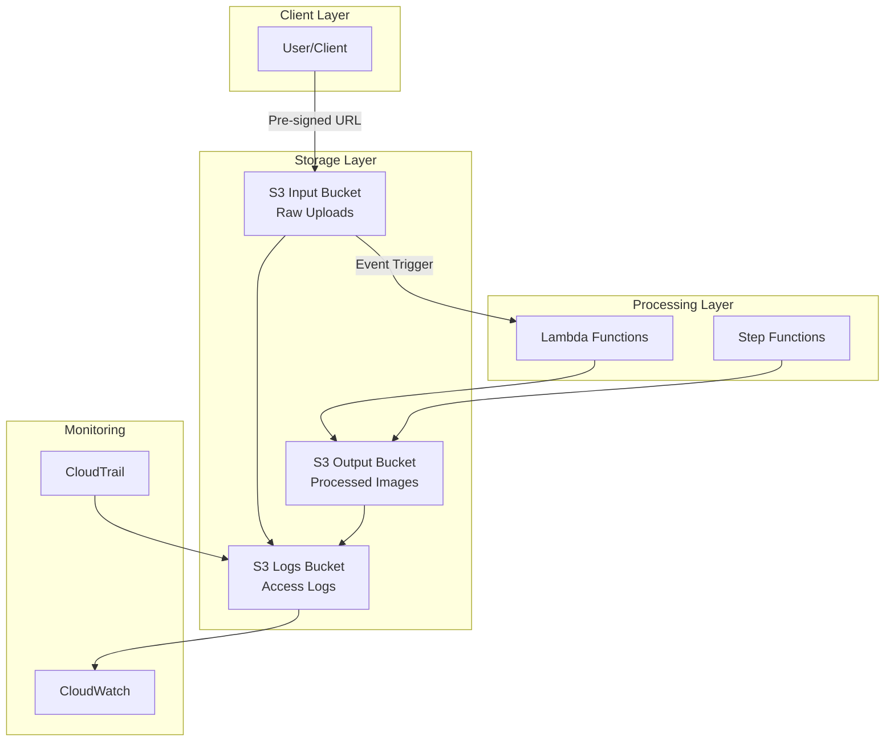

# Amazon S3 Documentation

## Overview

Amazon S3 serves as the primary storage layer for the Serverless Image Processing Platform, providing secure, scalable, and durable object storage for both input images and processed outputs. The platform uses two separate S3 buckets with different configurations optimized for their specific use cases.

## Architecture



## Bucket Configuration

### 1. Input Bucket (`image-processing-input-{environment}`)

**Purpose**: Stores raw, unprocessed images uploaded by users

**Configuration**:
```hcl
resource "aws_s3_bucket" "input_bucket" {
  bucket = "image-processing-input-${var.environment}-${random_string.bucket_suffix.result}"
  
  tags = {
    Environment = var.environment
    Service     = "image-processing"
    Purpose     = "input-storage"
  }
}

resource "aws_s3_bucket_versioning" "input_bucket" {
  bucket = aws_s3_bucket.input_bucket.id
  versioning_configuration {
    status = "Enabled"
  }
}

resource "aws_s3_bucket_server_side_encryption_configuration" "input_bucket" {
  bucket = aws_s3_bucket.input_bucket.id

  rule {
    apply_server_side_encryption_by_default {
      kms_master_key_id = aws_kms_key.s3_key.arn
      sse_algorithm     = "aws:kms"
    }
    bucket_key_enabled = true
  }
}

resource "aws_s3_bucket_public_access_block" "input_bucket" {
  bucket = aws_s3_bucket.input_bucket.id

  block_public_acls       = true
  block_public_policy     = true
  ignore_public_acls      = true
  restrict_public_buckets = true
}

resource "aws_s3_bucket_lifecycle_configuration" "input_bucket" {
  bucket = aws_s3_bucket.input_bucket.id

  rule {
    id     = "input_lifecycle"
    status = "Enabled"

    transition {
      days          = 30
      storage_class = "STANDARD_IA"
    }

    transition {
      days          = 90
      storage_class = "GLACIER"
    }

    expiration {
      days = 365
    }

    noncurrent_version_transition {
      noncurrent_days = 7
      storage_class   = "STANDARD_IA"
    }

    noncurrent_version_expiration {
      noncurrent_days = 30
    }
  }
}
```

**Key Features**:
- **Versioning**: Enabled for data protection
- **Encryption**: KMS encryption at rest
- **Public Access**: Completely blocked
- **Lifecycle**: Automatic tiering and cleanup
- **Event Notifications**: Triggers Lambda on upload

### 2. Output Bucket (`image-processing-output-{environment}`)

**Purpose**: Stores processed images and generated thumbnails

**Configuration**:
```hcl
resource "aws_s3_bucket" "output_bucket" {
  bucket = "image-processing-output-${var.environment}-${random_string.bucket_suffix.result}"
  
  tags = {
    Environment = var.environment
    Service     = "image-processing"
    Purpose     = "output-storage"
  }
}

resource "aws_s3_bucket_versioning" "output_bucket" {
  bucket = aws_s3_bucket.output_bucket.id
  versioning_configuration {
    status = "Enabled"
  }
}

resource "aws_s3_bucket_server_side_encryption_configuration" "output_bucket" {
  bucket = aws_s3_bucket.output_bucket.id

  rule {
    apply_server_side_encryption_by_default {
      kms_master_key_id = aws_kms_key.s3_key.arn
      sse_algorithm     = "aws:kms"
    }
    bucket_key_enabled = true
  }
}

resource "aws_s3_bucket_public_access_block" "output_bucket" {
  bucket = aws_s3_bucket.output_bucket.id

  block_public_acls       = true
  block_public_policy     = true
  ignore_public_acls      = true
  restrict_public_buckets = true
}

resource "aws_s3_bucket_lifecycle_configuration" "output_bucket" {
  bucket = aws_s3_bucket.output_bucket.id

  rule {
    id     = "output_lifecycle"
    status = "Enabled"

    transition {
      days          = 90
      storage_class = "STANDARD_IA"
    }

    transition {
      days          = 180
      storage_class = "GLACIER"
    }

    expiration {
      days = 2555  # 7 years
    }

    noncurrent_version_transition {
      noncurrent_days = 30
      storage_class   = "STANDARD_IA"
    }

    noncurrent_version_expiration {
      noncurrent_days = 90
    }
  }
}
```

**Key Features**:
- **Versioning**: Enabled for data protection
- **Encryption**: KMS encryption at rest
- **Public Access**: Completely blocked
- **Lifecycle**: Longer retention for processed images
- **CDN Ready**: Compatible with CloudFront

### 3. Logs Bucket (`image-processing-logs-{environment}`)

**Purpose**: Stores access logs and audit information

**Configuration**:
```hcl
resource "aws_s3_bucket" "logs_bucket" {
  bucket = "image-processing-logs-${var.environment}-${random_string.bucket_suffix.result}"
  
  tags = {
    Environment = var.environment
    Service     = "image-processing"
    Purpose     = "logs-storage"
  }
}

resource "aws_s3_bucket_lifecycle_configuration" "logs_bucket" {
  bucket = aws_s3_bucket.logs_bucket.id

  rule {
    id     = "logs_lifecycle"
    status = "Enabled"

    transition {
      days          = 30
      storage_class = "STANDARD_IA"
    }

    transition {
      days          = 90
      storage_class = "GLACIER"
    }

    expiration {
      days = 2555  # 7 years for compliance
    }
  }
}
```

## Object Structure

### Input Bucket Object Structure
```
s3://image-processing-input-{environment}/
├── uploads/
│   ├── {userId}/
│   │   ├── {imageId}.jpg
│   │   ├── {imageId}.png
│   │   └── {imageId}.gif
│   └── temp/
│       └── {sessionId}/
└── metadata/
    └── {imageId}/
        └── upload-info.json
```

### Output Bucket Object Structure
```
s3://image-processing-output-{environment}/
├── processed/
│   ├── {userId}/
│   │   ├── {imageId}/
│   │   │   ├── original.jpg
│   │   │   ├── small.jpg
│   │   │   ├── medium.jpg
│   │   │   ├── large.jpg
│   │   │   └── thumbnail.jpg
│   │   └── {imageId}/
│   └── watermarked/
│       └── {userId}/
│           └── {imageId}/
└── metadata/
    └── {imageId}/
        └── processing-info.json
```

## Security Configuration

### KMS Encryption
```hcl
resource "aws_kms_key" "s3_key" {
  description             = "KMS key for S3 bucket encryption"
  deletion_window_in_days = 7
  enable_key_rotation     = true

  policy = jsonencode({
    Version = "2012-10-17"
    Statement = [
      {
        Sid    = "Enable IAM User Permissions"
        Effect = "Allow"
        Principal = {
          AWS = "arn:aws:iam::${data.aws_caller_identity.current.account_id}:root"
        }
        Action   = "kms:*"
        Resource = "*"
      },
      {
        Sid    = "Allow Lambda to use the key"
        Effect = "Allow"
        Principal = {
          Service = "lambda.amazonaws.com"
        }
        Action = [
          "kms:Decrypt",
          "kms:GenerateDataKey"
        ]
        Resource = "*"
        Condition = {
          StringEquals = {
            "aws:SourceAccount" = data.aws_caller_identity.current.account_id
          }
        }
      }
    ]
  })

  tags = {
    Environment = var.environment
    Service     = "s3-encryption"
  }
}
```

### Bucket Policies
```hcl
resource "aws_s3_bucket_policy" "input_bucket_policy" {
  bucket = aws_s3_bucket.input_bucket.id

  policy = jsonencode({
    Version = "2012-10-17"
    Statement = [
      {
        Sid    = "DenyUnencryptedObjectUploads"
        Effect = "Deny"
        Principal = "*"
        Action = "s3:PutObject"
        Resource = "${aws_s3_bucket.input_bucket.arn}/*"
        Condition = {
          StringNotEquals = {
            "s3:x-amz-server-side-encryption" = "aws:kms"
          }
        }
      },
      {
        Sid    = "DenyIncorrectEncryptionHeader"
        Effect = "Deny"
        Principal = "*"
        Action = "s3:PutObject"
        Resource = "${aws_s3_bucket.input_bucket.arn}/*"
        Condition = {
          StringNotEquals = {
            "s3:x-amz-server-side-encryption-aws-kms-key-id" = aws_kms_key.s3_key.arn
          }
        }
      },
      {
        Sid    = "DenyUnencryptedObjectDownloads"
        Effect = "Deny"
        Principal = "*"
        Action = "s3:GetObject"
        Resource = "${aws_s3_bucket.input_bucket.arn}/*"
        Condition = {
          Null = {
            "s3:x-amz-server-side-encryption" = "true"
          }
        }
      }
    ]
  })
}
```

## Pre-signed URL Generation

### Upload URL Generation
```python
import boto3
import json
from datetime import datetime, timedelta
import uuid

def generate_upload_url(user_id, file_name, file_type):
    """Generate pre-signed URL for secure upload"""
    s3_client = boto3.client('s3')
    
    # Generate unique image ID
    image_id = f"img_{uuid.uuid4().hex}"
    
    # Create S3 key
    s3_key = f"uploads/{user_id}/{image_id}.{file_name.split('.')[-1]}"
    
    # Generate pre-signed URL
    presigned_url = s3_client.generate_presigned_url(
        'put_object',
        Params={
            'Bucket': os.environ['S3_INPUT_BUCKET'],
            'Key': s3_key,
            'ContentType': file_type,
            'ServerSideEncryption': 'aws:kms',
            'SSEKMSKeyId': os.environ['KMS_KEY_ID'],
            'Metadata': {
                'user-id': user_id,
                'image-id': image_id,
                'original-filename': file_name,
                'upload-timestamp': datetime.utcnow().isoformat()
            }
        },
        ExpiresIn=3600  # 1 hour
    )
    
    return {
        'uploadUrl': presigned_url,
        'fileKey': s3_key,
        'imageId': image_id,
        'expiresIn': 3600
    }
```

### Download URL Generation
```python
def generate_download_url(user_id, image_id, size='original'):
    """Generate pre-signed URL for secure download"""
    s3_client = boto3.client('s3')
    
    # Determine S3 key based on size
    if size == 'original':
        s3_key = f"processed/{user_id}/{image_id}/original.jpg"
    else:
        s3_key = f"processed/{user_id}/{image_id}/{size}.jpg"
    
    # Generate pre-signed URL
    presigned_url = s3_client.generate_presigned_url(
        'get_object',
        Params={
            'Bucket': os.environ['S3_OUTPUT_BUCKET'],
            'Key': s3_key
        },
        ExpiresIn=3600  # 1 hour
    )
    
    return {
        'downloadUrl': presigned_url,
        'expiresIn': 3600
    }
```

## Event Notifications

### S3 Event Configuration
```hcl
resource "aws_s3_bucket_notification" "input_bucket_notification" {
  bucket = aws_s3_bucket.input_bucket.id

  lambda_function {
    lambda_function_arn = aws_lambda_function.s3_event_handler.arn
    events              = ["s3:ObjectCreated:*"]
    filter_prefix       = "uploads/"
    filter_suffix       = ".jpg"
  }

  lambda_function {
    lambda_function_arn = aws_lambda_function.s3_event_handler.arn
    events              = ["s3:ObjectCreated:*"]
    filter_prefix       = "uploads/"
    filter_suffix       = ".png"
  }

  lambda_function {
    lambda_function_arn = aws_lambda_function.s3_event_handler.arn
    events              = ["s3:ObjectCreated:*"]
    filter_prefix       = "uploads/"
    filter_suffix       = ".gif"
  }

  depends_on = [aws_lambda_permission.s3_event_handler]
}
```

### Lambda Permission
```hcl
resource "aws_lambda_permission" "s3_event_handler" {
  statement_id  = "AllowS3Invoke"
  action        = "lambda:InvokeFunction"
  function_name = aws_lambda_function.s3_event_handler.function_name
  principal     = "s3.amazonaws.com"
  source_arn    = aws_s3_bucket.input_bucket.arn
}
```

## Access Logging

### Bucket Logging Configuration
```hcl
resource "aws_s3_bucket_logging" "input_bucket_logging" {
  bucket = aws_s3_bucket.input_bucket.id

  target_bucket = aws_s3_bucket.logs_bucket.id
  target_prefix = "logs/input-bucket/"
}

resource "aws_s3_bucket_logging" "output_bucket_logging" {
  bucket = aws_s3_bucket.output_bucket.id

  target_bucket = aws_s3_bucket.logs_bucket.id
  target_prefix = "logs/output-bucket/"
}
```

### Log Format
```
79a59df900b949e55d96a1e698fbacedfd6e09d98eacf8f8d5218e7cd47ef2be image-processing-input-prod [06/Feb/2019:00:00:38 +0000] 192.0.2.3 79a59df900b949e55d96a1e698fbacedfd6e09d98eacf8f8d5218e7cd47ef2be 3E57427F3EXAMPLE REST.GET.VERSIONING - "GET /image-processing-input-prod?versioning HTTP/1.1" 200 - 113 - 7 - "-" "S3Console/0.4" -
```

## Lifecycle Management

### Input Bucket Lifecycle
```python
def configure_input_lifecycle():
    """Configure lifecycle rules for input bucket"""
    lifecycle_rules = [
        {
            'ID': 'input_lifecycle',
            'Status': 'Enabled',
            'Filter': {
                'Prefix': 'uploads/'
            },
            'Transitions': [
                {
                    'Days': 30,
                    'StorageClass': 'STANDARD_IA'
                },
                {
                    'Days': 90,
                    'StorageClass': 'GLACIER'
                }
            ],
            'Expiration': {
                'Days': 365
            },
            'NoncurrentVersionTransitions': [
                {
                    'NoncurrentDays': 7,
                    'StorageClass': 'STANDARD_IA'
                }
            ],
            'NoncurrentVersionExpiration': {
                'NoncurrentDays': 30
            }
        }
    ]
    
    return lifecycle_rules
```

### Output Bucket Lifecycle
```python
def configure_output_lifecycle():
    """Configure lifecycle rules for output bucket"""
    lifecycle_rules = [
        {
            'ID': 'output_lifecycle',
            'Status': 'Enabled',
            'Filter': {
                'Prefix': 'processed/'
            },
            'Transitions': [
                {
                    'Days': 90,
                    'StorageClass': 'STANDARD_IA'
                },
                {
                    'Days': 180,
                    'StorageClass': 'GLACIER'
                }
            ],
            'Expiration': {
                'Days': 2555  # 7 years
            },
            'NoncurrentVersionTransitions': [
                {
                    'NoncurrentDays': 30,
                    'StorageClass': 'STANDARD_IA'
                }
            ],
            'NoncurrentVersionExpiration': {
                'NoncurrentDays': 90
            }
        }
    ]
    
    return lifecycle_rules
```

## Monitoring & Alerting

### CloudWatch Metrics
```python
def get_s3_metrics(bucket_name):
    """Get S3 bucket metrics from CloudWatch"""
    cloudwatch = boto3.client('cloudwatch')
    
    metrics = [
        'NumberOfObjects',
        'BucketSizeBytes',
        'AllRequests',
        'GetRequests',
        'PutRequests',
        'DeleteRequests',
        'HeadRequests',
        '4xxError',
        '5xxError'
    ]
    
    for metric in metrics:
        response = cloudwatch.get_metric_statistics(
            Namespace='AWS/S3',
            MetricName=metric,
            Dimensions=[
                {
                    'Name': 'BucketName',
                    'Value': bucket_name
                },
                {
                    'Name': 'StorageType',
                    'Value': 'StandardStorage'
                }
            ],
            StartTime=datetime.utcnow() - timedelta(hours=1),
            EndTime=datetime.utcnow(),
            Period=300,
            Statistics=['Sum', 'Average', 'Maximum']
        )
        print(f"{metric}: {response['Datapoints']}")
```

### CloudWatch Alarms
```hcl
resource "aws_cloudwatch_metric_alarm" "s3_errors" {
  alarm_name          = "s3-4xx-5xx-errors"
  comparison_operator = "GreaterThanThreshold"
  evaluation_periods  = "2"
  metric_name         = "4xxError"
  namespace           = "AWS/S3"
  period              = "300"
  statistic           = "Sum"
  threshold           = "10"
  alarm_description   = "This metric monitors S3 4xx errors"
  
  dimensions = {
    BucketName = aws_s3_bucket.input_bucket.bucket
  }
}

resource "aws_cloudwatch_metric_alarm" "s3_bucket_size" {
  alarm_name          = "s3-bucket-size-alarm"
  comparison_operator = "GreaterThanThreshold"
  evaluation_periods  = "2"
  metric_name         = "BucketSizeBytes"
  namespace           = "AWS/S3"
  period              = "3600"
  statistic           = "Average"
  threshold           = "107374182400"  # 100 GB
  alarm_description   = "This metric monitors S3 bucket size"
  
  dimensions = {
    BucketName = aws_s3_bucket.input_bucket.bucket
    StorageType = "StandardStorage"
  }
}
```

## Best Practices

### 1. Security
- **Encryption**: Always use KMS encryption for sensitive data
- **Access Control**: Use bucket policies and IAM roles
- **Public Access**: Block all public access by default
- **Versioning**: Enable versioning for data protection

### 2. Performance
- **Pre-signed URLs**: Use for secure direct uploads
- **CDN**: Use CloudFront for global content delivery
- **Transfer Acceleration**: Enable for faster uploads
- **Parallel Uploads**: Use multipart uploads for large files

### 3. Cost Optimization
- **Lifecycle Policies**: Automatically move data to cheaper storage
- **Intelligent Tiering**: Use for unpredictable access patterns
- **Storage Classes**: Choose appropriate storage class for data
- **Monitoring**: Track storage usage and costs

### 4. Reliability
- **Cross-Region Replication**: For disaster recovery
- **Versioning**: Protection against accidental deletion
- **Backup**: Regular backup verification
- **Monitoring**: Comprehensive monitoring and alerting

### 5. Compliance
- **Access Logging**: Enable for audit trails
- **Encryption**: Meet regulatory requirements
- **Retention**: Configure appropriate retention periods
- **Audit**: Regular security audits

## Troubleshooting

### Common Issues

#### 1. Upload Failures
**Symptoms**: Pre-signed URL uploads failing
**Solutions**:
- Check URL expiration time
- Verify bucket permissions
- Check network connectivity
- Validate file size limits

#### 2. Access Denied Errors
**Symptoms**: 403 Forbidden errors
**Solutions**:
- Review IAM policies
- Check bucket policies
- Verify KMS key permissions
- Check public access settings

#### 3. High Costs
**Symptoms**: Unexpected S3 charges
**Solutions**:
- Review lifecycle policies
- Check for unused objects
- Optimize storage classes
- Monitor data transfer costs

#### 4. Performance Issues
**Symptoms**: Slow uploads/downloads
**Solutions**:
- Enable Transfer Acceleration
- Use CloudFront for downloads
- Optimize object sizes
- Check network latency

This S3 implementation provides a robust, secure, and cost-efficient storage solution for the Serverless Image Processing Platform, with comprehensive monitoring, lifecycle management, and security features. 