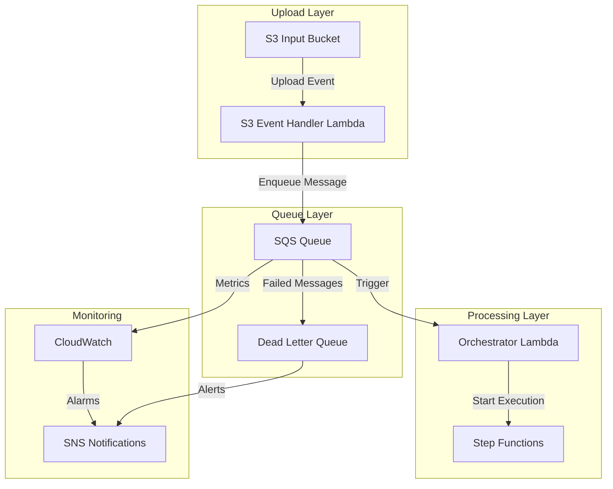

# Amazon SQS Documentation

## Overview

Amazon Simple Queue Service (SQS) serves as the message queuing layer in the Serverless Image Processing Platform, providing reliable, scalable, and decoupled communication between the S3 event handler and the orchestrator Lambda function. SQS ensures that image processing requests are not lost and can be processed reliably even during high load or temporary service outages.

## Architecture



## Queue Configuration

### Main Processing Queue
```hcl
resource "aws_sqs_queue" "upload_queue" {
  name = "${var.project_name}-upload-queue"
  
  # Message retention
  message_retention_seconds = 1209600  # 14 days
  
  # Visibility timeout
  visibility_timeout_seconds = 300  # 5 minutes
  
  # Receive message wait time (long polling)
  receive_wait_time_seconds = 20
  
  # Maximum message size
  max_message_size = 262144  # 256 KB
  
  # Delay seconds
  delay_seconds = 0
  
  # Redrive policy for dead letter queue
  redrive_policy = jsonencode({
    deadLetterTargetArn = aws_sqs_queue.dead_letter_queue.arn
    maxReceiveCount     = 3
  })
  
  # Server-side encryption
  sqs_managed_sse_enabled = true
  
  # Tags
  tags = {
    Environment = var.environment
    Service     = "image-processing"
    Purpose     = "upload-queue"
  }
}
```

### Dead Letter Queue
```hcl
resource "aws_sqs_queue" "dead_letter_queue" {
  name = "${var.project_name}-dead-letter-queue"
  
  # Message retention
  message_retention_seconds = 1209600  # 14 days
  
  # Visibility timeout
  visibility_timeout_seconds = 300  # 5 minutes
  
  # Receive message wait time
  receive_wait_time_seconds = 20
  
  # Maximum message size
  max_message_size = 262144  # 256 KB
  
  # Server-side encryption
  sqs_managed_sse_enabled = true
  
  # Tags
  tags = {
    Environment = var.environment
    Service     = "image-processing"
    Purpose     = "dead-letter-queue"
  }
}
```

### Queue Policy
```hcl
resource "aws_sqs_queue_policy" "upload_queue_policy" {
  queue_url = aws_sqs_queue.upload_queue.id

  policy = jsonencode({
    Version = "2012-10-17"
    Statement = [
      {
        Sid    = "AllowLambdaToSendMessages"
        Effect = "Allow"
        Principal = {
          Service = "lambda.amazonaws.com"
        }
        Action = [
          "sqs:SendMessage"
        ]
        Resource = aws_sqs_queue.upload_queue.arn
        Condition = {
          ArnEquals = {
            "aws:SourceArn" = aws_lambda_function.s3_event_handler.arn
          }
        }
      },
      {
        Sid    = "AllowLambdaToReceiveMessages"
        Effect = "Allow"
        Principal = {
          Service = "lambda.amazonaws.com"
        }
        Action = [
          "sqs:ReceiveMessage",
          "sqs:DeleteMessage",
          "sqs:GetQueueAttributes"
        ]
        Resource = aws_sqs_queue.upload_queue.arn
        Condition = {
          ArnEquals = {
            "aws:SourceArn" = aws_lambda_function.orchestrator.arn
          }
        }
      }
    ]
  })
}
```

## Message Structure

### Upload Event Message
```json
{
  "MessageId": "msg-12345678-1234-1234-1234-123456789012",
  "ReceiptHandle": "AQEB...",
  "MD5OfBody": "abc123def456",
  "Body": {
    "imageId": "img_1234567890abcdef",
    "userId": "user_12345678-1234-1234-1234-123456789012",
    "s3Key": "uploads/user-id/image-id.jpg",
    "fileName": "vacation-photo.jpg",
    "fileSize": 2048576,
    "fileType": "image/jpeg",
    "uploadTimestamp": "2024-01-01T12:00:00Z",
    "metadata": {
      "camera": "iPhone 12",
      "location": "Beach Resort",
      "description": "Family vacation photo"
    }
  },
  "Attributes": {
    "SenderId": "AIDACKCEVSQ6C2EXAMPLE",
    "SentTimestamp": "1640995200000",
    "ApproximateReceiveCount": "1",
    "ApproximateFirstReceiveTimestamp": "1640995200000"
  }
}
```

### Message Attributes
```json
{
  "MessageAttributes": {
    "imageId": {
      "StringValue": "img_1234567890abcdef",
      "DataType": "String"
    },
    "userId": {
      "StringValue": "user_12345678-1234-1234-1234-123456789012",
      "DataType": "String"
    },
    "priority": {
      "StringValue": "normal",
      "DataType": "String"
    },
    "processingType": {
      "StringValue": "standard",
      "DataType": "String"
    }
  }
}
```

## Message Handling

### Enqueueing Messages (S3 Event Handler)
```python
import boto3
import json
import os
from datetime import datetime
import uuid

def enqueue_upload_event(s3_event):
    """Enqueue S3 upload event to SQS"""
    sqs_client = boto3.client('sqs')
    
    # Extract information from S3 event
    bucket_name = s3_event['Records'][0]['s3']['bucket']['name']
    object_key = s3_event['Records'][0]['s3']['object']['key']
    file_size = s3_event['Records'][0]['s3']['object']['size']
    
    # Parse user ID and image ID from S3 key
    # Expected format: uploads/{userId}/{imageId}.{extension}
    path_parts = object_key.split('/')
    if len(path_parts) >= 3:
        user_id = path_parts[1]
        image_id = path_parts[2].split('.')[0]
        file_extension = path_parts[2].split('.')[-1]
        file_name = f"{image_id}.{file_extension}"
    else:
        raise ValueError(f"Invalid S3 key format: {object_key}")
    
    # Determine file type
    file_type_map = {
        'jpg': 'image/jpeg',
        'jpeg': 'image/jpeg',
        'png': 'image/png',
        'gif': 'image/gif'
    }
    file_type = file_type_map.get(file_extension.lower(), 'application/octet-stream')
    
    # Create message body
    message_body = {
        'imageId': image_id,
        'userId': user_id,
        's3Key': object_key,
        'fileName': file_name,
        'fileSize': file_size,
        'fileType': file_type,
        'uploadTimestamp': datetime.utcnow().isoformat(),
        'bucketName': bucket_name
    }
    
    # Add metadata if available
    try:
        s3_client = boto3.client('s3')
        response = s3_client.head_object(Bucket=bucket_name, Key=object_key)
        if 'Metadata' in response:
            message_body['metadata'] = response['Metadata']
    except Exception as e:
        print(f"Warning: Could not retrieve metadata for {object_key}: {e}")
    
    # Send message to SQS
    try:
        response = sqs_client.send_message(
            QueueUrl=os.environ['SQS_QUEUE_URL'],
            MessageBody=json.dumps(message_body),
            MessageAttributes={
                'imageId': {
                    'StringValue': image_id,
                    'DataType': 'String'
                },
                'userId': {
                    'StringValue': user_id,
                    'DataType': 'String'
                },
                'priority': {
                    'StringValue': 'normal',
                    'DataType': 'String'
                },
                'processingType': {
                    'StringValue': 'standard',
                    'DataType': 'String'
                }
            }
        )
        
        print(f"Message enqueued successfully: {response['MessageId']}")
        return response['MessageId']
        
    except Exception as e:
        print(f"Error enqueueing message: {e}")
        raise

def lambda_handler(event, context):
    """S3 Event Handler Lambda function"""
    try:
        # Process each S3 event record
        for record in event['Records']:
            if record['eventSource'] == 'aws:s3':
                message_id = enqueue_upload_event({'Records': [record]})
                print(f"Successfully processed S3 event: {message_id}")
        
        return {
            'statusCode': 200,
            'body': json.dumps({
                'message': 'S3 events processed successfully',
                'processedCount': len(event['Records'])
            })
        }
        
    except Exception as e:
        print(f"Error processing S3 events: {e}")
        raise
```

### Processing Messages (Orchestrator)
```python
import boto3
import json
import os
from datetime import datetime
import time

def process_sqs_message(message):
    """Process a single SQS message"""
    try:
        # Parse message body
        message_body = json.loads(message['Body'])
        
        # Extract message attributes
        image_id = message['MessageAttributes']['imageId']['StringValue']
        user_id = message['MessageAttributes']['userId']['StringValue']
        
        print(f"Processing message for image: {image_id}, user: {user_id}")
        
        # Start Step Functions execution
        sfn_client = boto3.client('stepfunctions')
        
        execution_name = f"image-processing-{image_id}-{int(time.time())}"
        
        response = sfn_client.start_execution(
            stateMachineArn=os.environ['STEP_FUNCTIONS_ARN'],
            name=execution_name,
            input=json.dumps(message_body)
        )
        
        print(f"Step Functions execution started: {response['executionArn']}")
        
        # Update DynamoDB with processing status
        dynamodb = boto3.resource('dynamodb')
        table = dynamodb.Table(os.environ['DYNAMODB_TABLE'])
        
        table.update_item(
            Key={
                'imageId': image_id,
                'userId': user_id
            },
            UpdateExpression='SET #status = :status, stepFunctionsArn = :sfnArn, updatedAt = :updatedAt',
            ExpressionAttributeNames={
                '#status': 'status'
            },
            ExpressionAttributeValues={
                ':status': 'processing',
                ':sfnArn': response['executionArn'],
                ':updatedAt': datetime.utcnow().isoformat()
            }
        )
        
        return {
            'success': True,
            'executionArn': response['executionArn'],
            'imageId': image_id
        }
        
    except Exception as e:
        print(f"Error processing message: {e}")
        return {
            'success': False,
            'error': str(e),
            'imageId': image_id if 'image_id' in locals() else 'unknown'
        }

def lambda_handler(event, context):
    """Orchestrator Lambda function triggered by SQS"""
    processed_count = 0
    failed_count = 0
    
    try:
        # Process each message in the batch
        for record in event['Records']:
            result = process_sqs_message(record)
            
            if result['success']:
                processed_count += 1
                print(f"Successfully processed image: {result['imageId']}")
            else:
                failed_count += 1
                print(f"Failed to process image: {result['imageId']}, error: {result['error']}")
        
        return {
            'statusCode': 200,
            'body': json.dumps({
                'message': 'SQS messages processed',
                'processedCount': processed_count,
                'failedCount': failed_count
            })
        }
        
    except Exception as e:
        print(f"Error in orchestrator: {e}")
        raise
```

## Error Handling

### Dead Letter Queue Processing
```python
import boto3
import json
import os
from datetime import datetime

def process_dead_letter_queue():
    """Process messages from the dead letter queue"""
    sqs_client = boto3.client('sqs')
    sns_client = boto3.client('sns')
    
    try:
        # Receive messages from DLQ
        response = sqs_client.receive_message(
            QueueUrl=os.environ['DLQ_URL'],
            MaxNumberOfMessages=10,
            WaitTimeSeconds=20
        )
        
        if 'Messages' not in response:
            print("No messages in DLQ")
            return
        
        for message in response['Messages']:
            try:
                # Parse message
                message_body = json.loads(message['Body'])
                image_id = message_body.get('imageId', 'unknown')
                user_id = message_body.get('userId', 'unknown')
                
                print(f"Processing DLQ message for image: {image_id}")
                
                # Send notification
                sns_client.publish(
                    TopicArn=os.environ['SNS_TOPIC_ARN'],
                    Subject=f"Image Processing Failed - {image_id}",
                    Message=json.dumps({
                        'imageId': image_id,
                        'userId': user_id,
                        'error': 'Message moved to DLQ after multiple failures',
                        'timestamp': datetime.utcnow().isoformat(),
                        'messageBody': message_body
                    }, indent=2)
                )
                
                # Update DynamoDB
                dynamodb = boto3.resource('dynamodb')
                table = dynamodb.Table(os.environ['DYNAMODB_TABLE'])
                
                table.update_item(
                    Key={
                        'imageId': image_id,
                        'userId': user_id
                    },
                    UpdateExpression='SET #status = :status, errorInfo = :errorInfo, updatedAt = :updatedAt',
                    ExpressionAttributeNames={
                        '#status': 'status'
                    },
                    ExpressionAttributeValues={
                        ':status': 'failed',
                        ':errorInfo': {
                            'reason': 'Message moved to DLQ',
                            'timestamp': datetime.utcnow().isoformat(),
                            'receiveCount': message.get('Attributes', {}).get('ApproximateReceiveCount', 'unknown')
                        },
                        ':updatedAt': datetime.utcnow().isoformat()
                    }
                )
                
                # Delete message from DLQ
                sqs_client.delete_message(
                    QueueUrl=os.environ['DLQ_URL'],
                    ReceiptHandle=message['ReceiptHandle']
                )
                
                print(f"Successfully processed DLQ message for image: {image_id}")
                
            except Exception as e:
                print(f"Error processing DLQ message: {e}")
                continue
        
    except Exception as e:
        print(f"Error accessing DLQ: {e}")
        raise

def lambda_handler(event, context):
    """DLQ Processor Lambda function"""
    try:
        process_dead_letter_queue()
        
        return {
            'statusCode': 200,
            'body': json.dumps({
                'message': 'DLQ processing completed'
            })
        }
        
    except Exception as e:
        print(f"Error in DLQ processor: {e}")
        raise
```

## Monitoring & Alerting

### CloudWatch Metrics
```python
import boto3
from datetime import datetime, timedelta

def get_sqs_metrics():
    """Get SQS metrics from CloudWatch"""
    cloudwatch = boto3.client('cloudwatch')
    
    metrics = [
        'NumberOfMessagesSent',
        'NumberOfMessagesReceived',
        'NumberOfMessagesDeleted',
        'ApproximateNumberOfMessagesVisible',
        'ApproximateNumberOfMessagesNotVisible',
        'ApproximateNumberOfMessagesDelayed',
        'SentMessageSize',
        'NumberOfEmptyReceives',
        'NumberOfMessagesMoved'
    ]
    
    for metric in metrics:
        response = cloudwatch.get_metric_statistics(
            Namespace='AWS/SQS',
            MetricName=metric,
            Dimensions=[
                {
                    'Name': 'QueueName',
                    'Value': os.environ['SQS_QUEUE_NAME']
                }
            ],
            StartTime=datetime.utcnow() - timedelta(hours=1),
            EndTime=datetime.utcnow(),
            Period=300,
            Statistics=['Sum', 'Average', 'Maximum']
        )
        print(f"{metric}: {response['Datapoints']}")
```

### CloudWatch Alarms
```hcl
resource "aws_cloudwatch_metric_alarm" "sqs_queue_depth" {
  alarm_name          = "sqs-queue-depth-alarm"
  comparison_operator = "GreaterThanThreshold"
  evaluation_periods  = "2"
  metric_name         = "ApproximateNumberOfMessagesVisible"
  namespace           = "AWS/SQS"
  period              = "300"
  statistic           = "Average"
  threshold           = "100"
  alarm_description   = "This metric monitors SQS queue depth"
  
  dimensions = {
    QueueName = aws_sqs_queue.upload_queue.name
  }
}

resource "aws_cloudwatch_metric_alarm" "sqs_dlq_messages" {
  alarm_name          = "sqs-dlq-messages-alarm"
  comparison_operator = "GreaterThanThreshold"
  evaluation_periods  = "1"
  metric_name         = "ApproximateNumberOfMessagesVisible"
  namespace           = "AWS/SQS"
  period              = "300"
  statistic           = "Average"
  threshold           = "1"
  alarm_description   = "This metric monitors messages in DLQ"
  
  dimensions = {
    QueueName = aws_sqs_queue.dead_letter_queue.name
  }
}

resource "aws_cloudwatch_metric_alarm" "sqs_age_of_oldest_message" {
  alarm_name          = "sqs-age-of-oldest-message-alarm"
  comparison_operator = "GreaterThanThreshold"
  evaluation_periods  = "2"
  metric_name         = "ApproximateAgeOfOldestMessage"
  namespace           = "AWS/SQS"
  period              = "300"
  statistic           = "Maximum"
  threshold           = "300"  # 5 minutes
  alarm_description   = "This metric monitors age of oldest message in queue"
  
  dimensions = {
    QueueName = aws_sqs_queue.upload_queue.name
  }
}
```

## Performance Optimization

### Batch Processing
```python
def process_messages_in_batch(messages, batch_size=10):
    """Process messages in batches for better performance"""
    results = []
    
    for i in range(0, len(messages), batch_size):
        batch = messages[i:i + batch_size]
        
        # Process batch in parallel
        import concurrent.futures
        
        with concurrent.futures.ThreadPoolExecutor(max_workers=5) as executor:
            future_to_message = {
                executor.submit(process_sqs_message, message): message 
                for message in batch
            }
            
            for future in concurrent.futures.as_completed(future_to_message):
                message = future_to_message[future]
                try:
                    result = future.result()
                    results.append(result)
                except Exception as e:
                    print(f"Error processing message: {e}")
                    results.append({'success': False, 'error': str(e)})
    
    return results
```

### Long Polling
```python
def receive_messages_with_long_polling():
    """Receive messages using long polling for better efficiency"""
    sqs_client = boto3.client('sqs')
    
    response = sqs_client.receive_message(
        QueueUrl=os.environ['SQS_QUEUE_URL'],
        MaxNumberOfMessages=10,
        WaitTimeSeconds=20,  # Long polling
        AttributeNames=['All'],
        MessageAttributeNames=['All']
    )
    
    return response.get('Messages', [])
```

## Best Practices

### 1. Message Design
- **Idempotency**: Design messages to be idempotent
- **Size Limits**: Keep messages under 256 KB
- **Structured Data**: Use JSON for message bodies
- **Metadata**: Include relevant metadata in message attributes

### 2. Error Handling
- **Dead Letter Queues**: Always configure DLQs
- **Retry Logic**: Implement appropriate retry strategies
- **Error Logging**: Log all errors with context
- **Monitoring**: Monitor DLQ message counts

### 3. Performance
- **Batch Processing**: Process messages in batches
- **Long Polling**: Use long polling to reduce API calls
- **Concurrency**: Use appropriate concurrency levels
- **Visibility Timeout**: Set appropriate visibility timeouts

### 4. Security
- **Encryption**: Enable server-side encryption
- **Access Control**: Use IAM policies for access control
- **Queue Policies**: Configure appropriate queue policies
- **VPC Endpoints**: Use VPC endpoints for private access

### 5. Monitoring
- **Queue Depth**: Monitor queue depth
- **Message Age**: Monitor age of oldest message
- **Error Rates**: Monitor error rates
- **DLQ Monitoring**: Monitor dead letter queue

## Troubleshooting

### Common Issues

#### 1. High Queue Depth
**Symptoms**: Large number of messages in queue
**Solutions**:
- Increase Lambda concurrency
- Optimize message processing
- Add more processing capacity
- Check for processing bottlenecks

#### 2. Messages in DLQ
**Symptoms**: Messages appearing in dead letter queue
**Solutions**:
- Review error handling logic
- Check Lambda function logs
- Verify IAM permissions
- Review message format

#### 3. High Latency
**Symptoms**: Long processing times
**Solutions**:
- Use long polling
- Optimize Lambda functions
- Implement batch processing
- Review network connectivity

#### 4. Permission Errors
**Symptoms**: Access denied errors
**Solutions**:
- Review IAM policies
- Check queue policies
- Verify Lambda execution role
- Update resource permissions

This SQS implementation provides a robust, scalable, and reliable message queuing solution for the Serverless Image Processing Platform, with comprehensive error handling, monitoring, and performance optimization features. 