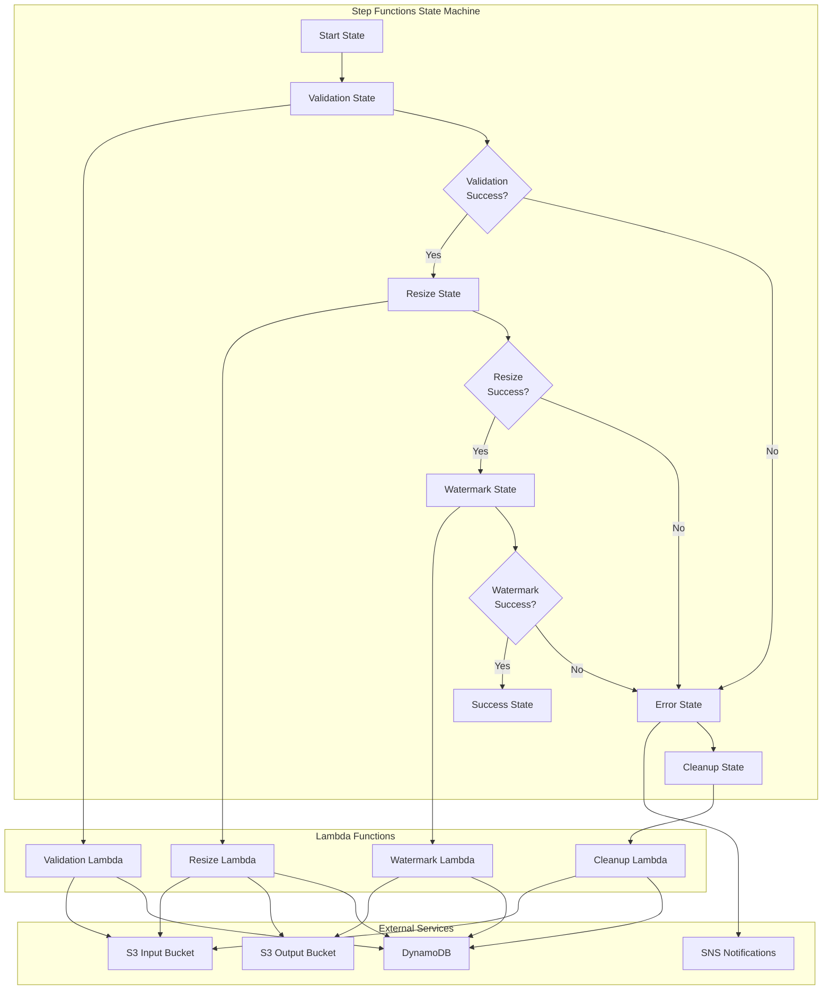

# AWS Step Functions Documentation

## Overview

AWS Step Functions orchestrates the image processing workflow, providing a visual, event-driven approach to coordinating the various Lambda functions involved in image validation, resizing, and watermarking. The state machine ensures reliable execution with built-in error handling, retries, and monitoring capabilities.

## Architecture



## State Machine Definition

### Complete State Machine
```json
{
  "Comment": "Image Processing Workflow",
  "StartAt": "ValidateImage",
  "States": {
    "ValidateImage": {
      "Type": "Task",
      "Resource": "arn:aws:lambda:${region}:${account}:function:${project_name}-validation",
      "Parameters": {
        "imageId.$": "$.imageId",
        "userId.$": "$.userId",
        "s3Key.$": "$.s3Key",
        "fileName.$": "$.fileName",
        "fileSize.$": "$.fileSize",
        "fileType.$": "$.fileType"
      },
      "ResultPath": "$.validationResult",
      "Next": "CheckValidationResult",
      "Retry": [
        {
          "ErrorEquals": ["Lambda.ServiceException", "Lambda.AWSLambdaException", "Lambda.SdkClientException"],
          "IntervalSeconds": 2,
          "MaxAttempts": 3,
          "BackoffRate": 2.0
        }
      ],
      "Catch": [
        {
          "ErrorEquals": ["States.ALL"],
          "Next": "HandleValidationError",
          "ResultPath": "$.error"
        }
      ]
    },
    "CheckValidationResult": {
      "Type": "Choice",
      "Choices": [
        {
          "Variable": "$.validationResult.result",
          "StringEquals": "valid",
          "Next": "ResizeImage"
        }
      ],
      "Default": "HandleValidationError"
    },
    "ResizeImage": {
      "Type": "Task",
      "Resource": "arn:aws:lambda:${region}:${account}:function:${project_name}-resize",
      "Parameters": {
        "imageId.$": "$.imageId",
        "userId.$": "$.userId",
        "s3Key.$": "$.s3Key",
        "validationResult.$": "$.validationResult"
      },
      "ResultPath": "$.resizeResult",
      "Next": "CheckResizeResult",
      "Retry": [
        {
          "ErrorEquals": ["Lambda.ServiceException", "Lambda.AWSLambdaException", "Lambda.SdkClientException"],
          "IntervalSeconds": 2,
          "MaxAttempts": 3,
          "BackoffRate": 2.0
        }
      ],
      "Catch": [
        {
          "ErrorEquals": ["States.ALL"],
          "Next": "HandleResizeError",
          "ResultPath": "$.error"
        }
      ]
    },
    "CheckResizeResult": {
      "Type": "Choice",
      "Choices": [
        {
          "Variable": "$.resizeResult.status",
          "StringEquals": "completed",
          "Next": "ApplyWatermark"
        }
      ],
      "Default": "HandleResizeError"
    },
    "ApplyWatermark": {
      "Type": "Task",
      "Resource": "arn:aws:lambda:${region}:${account}:function:${project_name}-watermark",
      "Parameters": {
        "imageId.$": "$.imageId",
        "userId.$": "$.userId",
        "resizeResult.$": "$.resizeResult"
      },
      "ResultPath": "$.watermarkResult",
      "Next": "CheckWatermarkResult",
      "Retry": [
        {
          "ErrorEquals": ["Lambda.ServiceException", "Lambda.AWSLambdaException", "Lambda.SdkClientException"],
          "IntervalSeconds": 2,
          "MaxAttempts": 3,
          "BackoffRate": 2.0
        }
      ],
      "Catch": [
        {
          "ErrorEquals": ["States.ALL"],
          "Next": "HandleWatermarkError",
          "ResultPath": "$.error"
        }
      ]
    },
    "CheckWatermarkResult": {
      "Type": "Choice",
      "Choices": [
        {
          "Variable": "$.watermarkResult.status",
          "StringEquals": "completed",
          "Next": "ProcessingComplete"
        }
      ],
      "Default": "HandleWatermarkError"
    },
    "ProcessingComplete": {
      "Type": "Succeed",
      "Comment": "Image processing completed successfully"
    },
    "HandleValidationError": {
      "Type": "Task",
      "Resource": "arn:aws:lambda:${region}:${account}:function:${project_name}-error-handler",
      "Parameters": {
        "imageId.$": "$.imageId",
        "userId.$": "$.userId",
        "error.$": "$.error",
        "step": "validation"
      },
      "Next": "SendErrorNotification",
      "ResultPath": "$.errorHandling"
    },
    "HandleResizeError": {
      "Type": "Task",
      "Resource": "arn:aws:lambda:${region}:${account}:function:${project_name}-error-handler",
      "Parameters": {
        "imageId.$": "$.imageId",
        "userId.$": "$.userId",
        "error.$": "$.error",
        "step": "resize"
      },
      "Next": "SendErrorNotification",
      "ResultPath": "$.errorHandling"
    },
    "HandleWatermarkError": {
      "Type": "Task",
      "Resource": "arn:aws:lambda:${region}:${account}:function:${project_name}-error-handler",
      "Parameters": {
        "imageId.$": "$.imageId",
        "userId.$": "$.userId",
        "error.$": "$.error",
        "step": "watermark"
      },
      "Next": "SendErrorNotification",
      "ResultPath": "$.errorHandling"
    },
    "SendErrorNotification": {
      "Type": "Task",
      "Resource": "arn:aws:sns:${region}:${account}:${sns_topic_name}",
      "Parameters": {
        "Message": {
          "Fn::Join": [
            "",
            [
              "Image processing failed for image ",
              {
                "Ref": "imageId"
              },
              " at step ",
              {
                "Ref": "step"
              },
              ". Error: ",
              {
                "Ref": "error"
              }
            ]
          ]
        },
        "Subject": "Image Processing Error"
      },
      "Next": "CleanupOnError"
    },
    "CleanupOnError": {
      "Type": "Task",
      "Resource": "arn:aws:lambda:${region}:${account}:function:${project_name}-cleanup",
      "Parameters": {
        "imageId.$": "$.imageId",
        "userId.$": "$.userId",
        "errorHandling.$": "$.errorHandling"
      },
      "End": true,
      "ResultPath": "$.cleanup"
    }
  }
}
```

## Terraform Configuration

### Step Functions State Machine
```hcl
resource "aws_sfn_state_machine" "image_processing" {
  name     = "${var.project_name}-image-processing"
  role_arn = aws_iam_role.step_functions_role.arn

  definition = jsonencode({
    Comment = "Image Processing Workflow"
    StartAt = "ValidateImage"
    States = {
      ValidateImage = {
        Type = "Task"
        Resource = aws_lambda_function.validation.invoke_arn
        Parameters = {
          "imageId.$" = "$.imageId"
          "userId.$" = "$.userId"
          "s3Key.$" = "$.s3Key"
          "fileName.$" = "$.fileName"
          "fileSize.$" = "$.fileSize"
          "fileType.$" = "$.fileType"
        }
        ResultPath = "$.validationResult"
        Next = "CheckValidationResult"
        Retry = [
          {
            ErrorEquals = ["Lambda.ServiceException", "Lambda.AWSLambdaException", "Lambda.SdkClientException"]
            IntervalSeconds = 2
            MaxAttempts = 3
            BackoffRate = 2.0
          }
        ]
        Catch = [
          {
            ErrorEquals = ["States.ALL"]
            Next = "HandleValidationError"
            ResultPath = "$.error"
          }
        ]
      }
      CheckValidationResult = {
        Type = "Choice"
        Choices = [
          {
            Variable = "$.validationResult.result"
            StringEquals = "valid"
            Next = "ResizeImage"
          }
        ]
        Default = "HandleValidationError"
      }
      ResizeImage = {
        Type = "Task"
        Resource = aws_lambda_function.resize.invoke_arn
        Parameters = {
          "imageId.$" = "$.imageId"
          "userId.$" = "$.userId"
          "s3Key.$" = "$.s3Key"
          "validationResult.$" = "$.validationResult"
        }
        ResultPath = "$.resizeResult"
        Next = "CheckResizeResult"
        Retry = [
          {
            ErrorEquals = ["Lambda.ServiceException", "Lambda.AWSLambdaException", "Lambda.SdkClientException"]
            IntervalSeconds = 2
            MaxAttempts = 3
            BackoffRate = 2.0
          }
        ]
        Catch = [
          {
            ErrorEquals = ["States.ALL"]
            Next = "HandleResizeError"
            ResultPath = "$.error"
          }
        ]
      }
      CheckResizeResult = {
        Type = "Choice"
        Choices = [
          {
            Variable = "$.resizeResult.status"
            StringEquals = "completed"
            Next = "ApplyWatermark"
          }
        ]
        Default = "HandleResizeError"
      }
      ApplyWatermark = {
        Type = "Task"
        Resource = aws_lambda_function.watermark.invoke_arn
        Parameters = {
          "imageId.$" = "$.imageId"
          "userId.$" = "$.userId"
          "resizeResult.$" = "$.resizeResult"
        }
        ResultPath = "$.watermarkResult"
        Next = "CheckWatermarkResult"
        Retry = [
          {
            ErrorEquals = ["Lambda.ServiceException", "Lambda.AWSLambdaException", "Lambda.SdkClientException"]
            IntervalSeconds = 2
            MaxAttempts = 3
            BackoffRate = 2.0
          }
        ]
        Catch = [
          {
            ErrorEquals = ["States.ALL"]
            Next = "HandleWatermarkError"
            ResultPath = "$.error"
          }
        ]
      }
      CheckWatermarkResult = {
        Type = "Choice"
        Choices = [
          {
            Variable = "$.watermarkResult.status"
            StringEquals = "completed"
            Next = "ProcessingComplete"
          }
        ]
        Default = "HandleWatermarkError"
      }
      ProcessingComplete = {
        Type = "Succeed"
        Comment = "Image processing completed successfully"
      }
      HandleValidationError = {
        Type = "Task"
        Resource = aws_lambda_function.error_handler.invoke_arn
        Parameters = {
          "imageId.$" = "$.imageId"
          "userId.$" = "$.userId"
          "error.$" = "$.error"
          "step" = "validation"
        }
        Next = "SendErrorNotification"
        ResultPath = "$.errorHandling"
      }
      HandleResizeError = {
        Type = "Task"
        Resource = aws_lambda_function.error_handler.invoke_arn
        Parameters = {
          "imageId.$" = "$.imageId"
          "userId.$" = "$.userId"
          "error.$" = "$.error"
          "step" = "resize"
        }
        Next = "SendErrorNotification"
        ResultPath = "$.errorHandling"
      }
      HandleWatermarkError = {
        Type = "Task"
        Resource = aws_lambda_function.error_handler.invoke_arn
        Parameters = {
          "imageId.$" = "$.imageId"
          "userId.$" = "$.userId"
          "error.$" = "$.error"
          "step" = "watermark"
        }
        Next = "SendErrorNotification"
        ResultPath = "$.errorHandling"
      }
      SendErrorNotification = {
        Type = "Task"
        Resource = "arn:aws:sns:${data.aws_region.current.name}:${data.aws_caller_identity.current.account_id}:${aws_sns_topic.notifications.name}"
        Parameters = {
          Message = {
            Fn::Join = [
              "",
              [
                "Image processing failed for image ",
                { "Ref": "imageId" },
                " at step ",
                { "Ref": "step" },
                ". Error: ",
                { "Ref": "error" }
              ]
            ]
          }
          Subject = "Image Processing Error"
        }
        Next = "CleanupOnError"
      }
      CleanupOnError = {
        Type = "Task"
        Resource = aws_lambda_function.cleanup.invoke_arn
        Parameters = {
          "imageId.$" = "$.imageId"
          "userId.$" = "$.userId"
          "errorHandling.$" = "$.errorHandling"
        }
        End = true
        ResultPath = "$.cleanup"
      }
    }
  })

  tags = {
    Environment = var.environment
    Service     = "step-functions"
  }
}
```

### IAM Role for Step Functions
```hcl
resource "aws_iam_role" "step_functions_role" {
  name = "${var.project_name}-step-functions-role"

  assume_role_policy = jsonencode({
    Version = "2012-10-17"
    Statement = [
      {
        Action = "sts:AssumeRole"
        Effect = "Allow"
        Principal = {
          Service = "states.amazonaws.com"
        }
      }
    ]
  })
}

resource "aws_iam_role_policy" "step_functions_policy" {
  name = "${var.project_name}-step-functions-policy"
  role = aws_iam_role.step_functions_role.id

  policy = jsonencode({
    Version = "2012-10-17"
    Statement = [
      {
        Effect = "Allow"
        Action = [
          "lambda:InvokeFunction"
        ]
        Resource = [
          aws_lambda_function.validation.arn,
          aws_lambda_function.resize.arn,
          aws_lambda_function.watermark.arn,
          aws_lambda_function.error_handler.arn,
          aws_lambda_function.cleanup.arn
        ]
      },
      {
        Effect = "Allow"
        Action = [
          "sns:Publish"
        ]
        Resource = aws_sns_topic.notifications.arn
      },
      {
        Effect = "Allow"
        Action = [
          "logs:CreateLogGroup",
          "logs:CreateLogStream",
          "logs:PutLogEvents"
        ]
        Resource = "arn:aws:logs:${data.aws_region.current.name}:${data.aws_caller_identity.current.account_id}:log-group:/aws/states/${var.project_name}-image-processing:*"
      }
    ]
  })
}
```

## State Execution Flow

### 1. Input Event
```json
{
  "imageId": "img_1234567890abcdef",
  "userId": "user_12345678-1234-1234-1234-123456789012",
  "s3Key": "uploads/user-id/image-id.jpg",
  "fileName": "vacation-photo.jpg",
  "fileSize": 2048576,
  "fileType": "image/jpeg"
}
```

### 2. Validation State
```json
{
  "imageId": "img_1234567890abcdef",
  "userId": "user_12345678-1234-1234-1234-123456789012",
  "s3Key": "uploads/user-id/image-id.jpg",
  "fileName": "vacation-photo.jpg",
  "fileSize": 2048576,
  "fileType": "image/jpeg",
  "validationResult": {
    "result": "valid",
    "imageMetadata": {
      "width": 1920,
      "height": 1080,
      "format": "JPEG",
      "colorSpace": "sRGB"
    },
    "validationDetails": {
      "fileSizeValid": true,
      "formatValid": true,
      "dimensionsValid": true
    }
  }
}
```

### 3. Resize State
```json
{
  "imageId": "img_1234567890abcdef",
  "userId": "user_12345678-1234-1234-1234-123456789012",
  "s3Key": "uploads/user-id/image-id.jpg",
  "fileName": "vacation-photo.jpg",
  "fileSize": 2048576,
  "fileType": "image/jpeg",
  "validationResult": {
    "result": "valid",
    "imageMetadata": {
      "width": 1920,
      "height": 1080,
      "format": "JPEG",
      "colorSpace": "sRGB"
    }
  },
  "resizeResult": {
    "status": "completed",
    "resizedImages": [
      {
        "size": "small",
        "dimensions": "800x600",
        "s3Key": "processed/user-id/image-id-small.jpg",
        "fileSize": 512000
      },
      {
        "size": "medium",
        "dimensions": "1200x900",
        "s3Key": "processed/user-id/image-id-medium.jpg",
        "fileSize": 1024000
      }
    ]
  }
}
```

### 4. Watermark State
```json
{
  "imageId": "img_1234567890abcdef",
  "userId": "user_12345678-1234-1234-1234-123456789012",
  "s3Key": "uploads/user-id/image-id.jpg",
  "fileName": "vacation-photo.jpg",
  "fileSize": 2048576,
  "fileType": "image/jpeg",
  "validationResult": {
    "result": "valid",
    "imageMetadata": {
      "width": 1920,
      "height": 1080,
      "format": "JPEG",
      "colorSpace": "sRGB"
    }
  },
  "resizeResult": {
    "status": "completed",
    "resizedImages": [
      {
        "size": "small",
        "dimensions": "800x600",
        "s3Key": "processed/user-id/image-id-small.jpg",
        "fileSize": 512000
      },
      {
        "size": "medium",
        "dimensions": "1200x900",
        "s3Key": "processed/user-id/image-id-medium.jpg",
        "fileSize": 1024000
      }
    ]
  },
  "watermarkResult": {
    "status": "completed",
    "watermarkedImages": [
      {
        "size": "small",
        "s3Key": "processed/user-id/image-id-small-watermarked.jpg",
        "watermarkType": "text",
        "watermarkText": "Processed by Image Platform"
      },
      {
        "size": "medium",
        "s3Key": "processed/user-id/image-id-medium-watermarked.jpg",
        "watermarkType": "text",
        "watermarkText": "Processed by Image Platform"
      }
    ]
  }
}
```

## Error Handling

### Retry Configuration
```json
{
  "Retry": [
    {
      "ErrorEquals": [
        "Lambda.ServiceException",
        "Lambda.AWSLambdaException",
        "Lambda.SdkClientException"
      ],
      "IntervalSeconds": 2,
      "MaxAttempts": 3,
      "BackoffRate": 2.0
    }
  ]
}
```

### Error States
```json
{
  "Catch": [
    {
      "ErrorEquals": ["States.ALL"],
      "Next": "HandleError",
      "ResultPath": "$.error"
    }
  ]
}
```

### Error Handler Lambda
```python
import json
import boto3
from datetime import datetime

def lambda_handler(event, context):
    """Handle errors in the Step Functions workflow"""
    
    image_id = event.get('imageId')
    user_id = event.get('userId')
    error = event.get('error')
    step = event.get('step')
    
    # Update DynamoDB with error status
    dynamodb = boto3.resource('dynamodb')
    table = dynamodb.Table(os.environ['DYNAMODB_TABLE'])
    
    try:
        table.update_item(
            Key={
                'imageId': image_id,
                'userId': user_id
            },
            UpdateExpression='SET #status = :status, errorInfo = :errorInfo, updatedAt = :updatedAt',
            ExpressionAttributeNames={
                '#status': 'status'
            },
            ExpressionAttributeValues={
                ':status': 'failed',
                ':errorInfo': {
                    'step': step,
                    'error': str(error),
                    'timestamp': datetime.utcnow().isoformat()
                },
                ':updatedAt': datetime.utcnow().isoformat()
            }
        )
        
        return {
            'statusCode': 200,
            'body': {
                'message': 'Error handled successfully',
                'imageId': image_id,
                'step': step,
                'error': str(error)
            }
        }
        
    except Exception as e:
        return {
            'statusCode': 500,
            'body': {
                'message': 'Failed to handle error',
                'error': str(e)
            }
        }
```

## Monitoring & Observability

### CloudWatch Metrics
```python
import boto3
from datetime import datetime, timedelta

def get_step_functions_metrics():
    """Get Step Functions metrics from CloudWatch"""
    cloudwatch = boto3.client('cloudwatch')
    
    metrics = [
        'ExecutionsStarted',
        'ExecutionsSucceeded',
        'ExecutionsFailed',
        'ExecutionsAborted',
        'ExecutionThrottled',
        'ExecutionsTimedOut'
    ]
    
    for metric in metrics:
        response = cloudwatch.get_metric_statistics(
            Namespace='AWS/States',
            MetricName=metric,
            Dimensions=[
                {
                    'Name': 'StateMachineArn',
                    'Value': os.environ['STEP_FUNCTIONS_ARN']
                }
            ],
            StartTime=datetime.utcnow() - timedelta(hours=1),
            EndTime=datetime.utcnow(),
            Period=300,
            Statistics=['Sum', 'Average', 'Maximum']
        )
        print(f"{metric}: {response['Datapoints']}")
```

### CloudWatch Alarms
```hcl
resource "aws_cloudwatch_metric_alarm" "step_functions_failures" {
  alarm_name          = "step-functions-execution-failures"
  comparison_operator = "GreaterThanThreshold"
  evaluation_periods  = "2"
  metric_name         = "ExecutionsFailed"
  namespace           = "AWS/States"
  period              = "300"
  statistic           = "Sum"
  threshold           = "5"
  alarm_description   = "This metric monitors Step Functions execution failures"
  
  dimensions = {
    StateMachineArn = aws_sfn_state_machine.image_processing.arn
  }
}

resource "aws_cloudwatch_metric_alarm" "step_functions_timeouts" {
  alarm_name          = "step-functions-execution-timeouts"
  comparison_operator = "GreaterThanThreshold"
  evaluation_periods  = "2"
  metric_name         = "ExecutionsTimedOut"
  namespace           = "AWS/States"
  period              = "300"
  statistic           = "Sum"
  threshold           = "3"
  alarm_description   = "This metric monitors Step Functions execution timeouts"
  
  dimensions = {
    StateMachineArn = aws_sfn_state_machine.image_processing.arn
  }
}
```

### X-Ray Tracing
```python
from aws_xray_sdk.core import xray_recorder
from aws_xray_sdk.core import patch_all

patch_all()

@xray_recorder.capture('step_functions_execution')
def execute_state_machine(input_data):
    """Execute Step Functions state machine with X-Ray tracing"""
    sfn_client = boto3.client('stepfunctions')
    
    try:
        response = sfn_client.start_execution(
            stateMachineArn=os.environ['STEP_FUNCTIONS_ARN'],
            name=f"image-processing-{input_data['imageId']}",
            input=json.dumps(input_data)
        )
        
        return response['executionArn']
        
    except Exception as e:
        xray_recorder.current_segment().add_error(e)
        raise
```

## Best Practices

### 1. State Design
- **Single Responsibility**: Each state should have a single, well-defined purpose
- **Error Handling**: Implement comprehensive error handling for each state
- **Retry Logic**: Use appropriate retry strategies for transient failures
- **Timeout Configuration**: Set reasonable timeouts for each state

### 2. Performance Optimization
- **Parallel Execution**: Use Map states for parallel processing
- **Choice States**: Use Choice states for conditional logic
- **Wait States**: Use Wait states for external dependencies
- **Pass States**: Use Pass states for data transformation

### 3. Error Handling
- **Catch Blocks**: Implement catch blocks for all states
- **Error States**: Create dedicated error handling states
- **Retry Policies**: Configure appropriate retry policies
- **Dead Letter Queues**: Use DLQs for failed executions

### 4. Monitoring
- **CloudWatch Metrics**: Monitor key performance indicators
- **X-Ray Tracing**: Enable distributed tracing
- **Logging**: Implement comprehensive logging
- **Alarms**: Set up appropriate CloudWatch alarms

### 5. Security
- **IAM Roles**: Use least-privilege IAM roles
- **Resource Policies**: Configure appropriate resource policies
- **Encryption**: Enable encryption for sensitive data
- **Access Control**: Implement proper access controls

## Troubleshooting

### Common Issues

#### 1. Execution Failures
**Symptoms**: High failure rate in CloudWatch metrics
**Solutions**:
- Check Lambda function logs
- Verify IAM permissions
- Review error handling logic
- Check resource limits

#### 2. Timeout Issues
**Symptoms**: High timeout rate in CloudWatch metrics
**Solutions**:
- Increase Lambda timeout settings
- Optimize Lambda function performance
- Review state machine timeout configuration
- Check external service response times

#### 3. Permission Errors
**Symptoms**: Access denied errors in execution logs
**Solutions**:
- Review IAM role policies
- Check resource ARNs
- Verify cross-service permissions
- Update resource policies

#### 4. State Machine Definition Errors
**Symptoms**: Invalid state machine definition
**Solutions**:
- Validate JSON syntax
- Check state references
- Verify Lambda ARNs
- Test state machine locally

This Step Functions implementation provides a robust, scalable, and reliable workflow orchestration solution for the Serverless Image Processing Platform, with comprehensive error handling, monitoring, and observability features. 