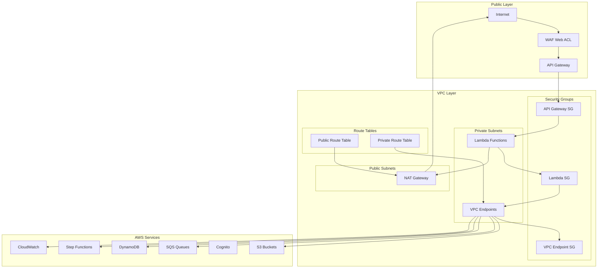

# VPC & Networking Documentation

## Overview

The Serverless Image Processing Platform implements a comprehensive private networking architecture using Amazon VPC to ensure all inter-service communication remains within the AWS network. This design enhances security, reduces latency, and provides better control over network traffic while maintaining the public accessibility required for user interactions.

## Architecture



## VPC Configuration

### Main VPC
```hcl
resource "aws_vpc" "main" {
  cidr_block           = var.vpc_cidr
  enable_dns_hostnames = true
  enable_dns_support   = true
  
  tags = {
    Name        = "${var.project_name}-vpc"
    Environment = var.environment
    Service     = "networking"
  }
}
```

### Subnets

#### Public Subnets
```hcl
resource "aws_subnet" "public" {
  count             = length(var.availability_zones)
  vpc_id            = aws_vpc.main.id
  cidr_block        = cidrsubnet(var.vpc_cidr, 8, count.index)
  availability_zone = var.availability_zones[count.index]
  
  map_public_ip_on_launch = true
  
  tags = {
    Name        = "${var.project_name}-public-subnet-${count.index + 1}"
    Environment = var.environment
    Type        = "public"
  }
}
```

#### Private Subnets
```hcl
resource "aws_subnet" "private" {
  count             = length(var.availability_zones)
  vpc_id            = aws_vpc.main.id
  cidr_block        = cidrsubnet(var.vpc_cidr, 8, count.index + length(var.availability_zones))
  availability_zone = var.availability_zones[count.index]
  
  tags = {
    Name        = "${var.project_name}-private-subnet-${count.index + 1}"
    Environment = var.environment
    Type        = "private"
  }
}
```

### Internet Gateway
```hcl
resource "aws_internet_gateway" "main" {
  vpc_id = aws_vpc.main.id
  
  tags = {
    Name        = "${var.project_name}-igw"
    Environment = var.environment
  }
}
```

### NAT Gateway
```hcl
resource "aws_eip" "nat" {
  domain = "vpc"
  
  tags = {
    Name        = "${var.project_name}-nat-eip"
    Environment = var.environment
  }
}

resource "aws_nat_gateway" "main" {
  allocation_id = aws_eip.nat.id
  subnet_id     = aws_subnet.public[0].id
  
  tags = {
    Name        = "${var.project_name}-nat-gateway"
    Environment = var.environment
  }
  
  depends_on = [aws_internet_gateway.main]
}
```

### Route Tables

#### Public Route Table
```hcl
resource "aws_route_table" "public" {
  vpc_id = aws_vpc.main.id
  
  route {
    cidr_block = "0.0.0.0/0"
    gateway_id = aws_internet_gateway.main.id
  }
  
  tags = {
    Name        = "${var.project_name}-public-rt"
    Environment = var.environment
    Type        = "public"
  }
}

resource "aws_route_table_association" "public" {
  count          = length(var.availability_zones)
  subnet_id      = aws_subnet.public[count.index].id
  route_table_id = aws_route_table.public.id
}
```

#### Private Route Table
```hcl
resource "aws_route_table" "private" {
  vpc_id = aws_vpc.main.id
  
  route {
    cidr_block     = "0.0.0.0/0"
    nat_gateway_id = aws_nat_gateway.main.id
  }
  
  tags = {
    Name        = "${var.project_name}-private-rt"
    Environment = var.environment
    Type        = "private"
  }
}

resource "aws_route_table_association" "private" {
  count          = length(var.availability_zones)
  subnet_id      = aws_subnet.private[count.index].id
  route_table_id = aws_route_table.private.id
}
```

## VPC Endpoints

### S3 VPC Endpoint
```hcl
resource "aws_vpc_endpoint" "s3" {
  vpc_id       = aws_vpc.main.id
  service_name = "com.amazonaws.${data.aws_region.current.name}.s3"
  
  vpc_endpoint_type = "Gateway"
  
  route_table_ids = [aws_route_table.private.id]
  
  tags = {
    Name        = "${var.project_name}-s3-endpoint"
    Environment = var.environment
    Service     = "s3"
  }
}
```

### SQS VPC Endpoint
```hcl
resource "aws_vpc_endpoint" "sqs" {
  vpc_id              = aws_vpc.main.id
  service_name        = "com.amazonaws.${data.aws_region.current.name}.sqs"
  vpc_endpoint_type   = "Interface"
  subnet_ids          = aws_subnet.private[*].id
  security_group_ids  = [aws_security_group.vpc_endpoint.id]
  private_dns_enabled = true
  
  tags = {
    Name        = "${var.project_name}-sqs-endpoint"
    Environment = var.environment
    Service     = "sqs"
  }
}
```

### DynamoDB VPC Endpoint
```hcl
resource "aws_vpc_endpoint" "dynamodb" {
  vpc_id       = aws_vpc.main.id
  service_name = "com.amazonaws.${data.aws_region.current.name}.dynamodb"
  
  vpc_endpoint_type = "Gateway"
  
  route_table_ids = [aws_route_table.private.id]
  
  tags = {
    Name        = "${var.project_name}-dynamodb-endpoint"
    Environment = var.environment
    Service     = "dynamodb"
  }
}
```

### Step Functions VPC Endpoint
```hcl
resource "aws_vpc_endpoint" "stepfunctions" {
  vpc_id              = aws_vpc.main.id
  service_name        = "com.amazonaws.${data.aws_region.current.name}.states"
  vpc_endpoint_type   = "Interface"
  subnet_ids          = aws_subnet.private[*].id
  security_group_ids  = [aws_security_group.vpc_endpoint.id]
  private_dns_enabled = true
  
  tags = {
    Name        = "${var.project_name}-stepfunctions-endpoint"
    Environment = var.environment
    Service     = "stepfunctions"
  }
}
```

### CloudWatch Logs VPC Endpoint
```hcl
resource "aws_vpc_endpoint" "logs" {
  vpc_id              = aws_vpc.main.id
  service_name        = "com.amazonaws.${data.aws_region.current.name}.logs"
  vpc_endpoint_type   = "Interface"
  subnet_ids          = aws_subnet.private[*].id
  security_group_ids  = [aws_security_group.vpc_endpoint.id]
  private_dns_enabled = true
  
  tags = {
    Name        = "${var.project_name}-logs-endpoint"
    Environment = var.environment
    Service     = "cloudwatch-logs"
  }
}
```

### SNS VPC Endpoint
```hcl
resource "aws_vpc_endpoint" "sns" {
  vpc_id              = aws_vpc.main.id
  service_name        = "com.amazonaws.${data.aws_region.current.name}.sns"
  vpc_endpoint_type   = "Interface"
  subnet_ids          = aws_subnet.private[*].id
  security_group_ids  = [aws_security_group.vpc_endpoint.id]
  private_dns_enabled = true
  
  tags = {
    Name        = "${var.project_name}-sns-endpoint"
    Environment = var.environment
    Service     = "sns"
  }
}
```

## Security Groups

### Lambda Security Group
```hcl
resource "aws_security_group" "lambda" {
  name_prefix = "${var.project_name}-lambda-"
  vpc_id      = aws_vpc.main.id
  
  description = "Security group for Lambda functions"
  
  # Outbound traffic to VPC endpoints
  egress {
    from_port   = 443
    to_port     = 443
    protocol    = "tcp"
    cidr_blocks = [var.vpc_cidr]
    description = "HTTPS to VPC endpoints"
  }
  
  # Outbound traffic to NAT Gateway (for external services)
  egress {
    from_port   = 443
    to_port     = 443
    protocol    = "tcp"
    cidr_blocks = ["0.0.0.0/0"]
    description = "HTTPS to internet via NAT Gateway"
  }
  
  # Outbound traffic for DNS
  egress {
    from_port   = 53
    to_port     = 53
    protocol    = "udp"
    cidr_blocks = ["0.0.0.0/0"]
    description = "DNS queries"
  }
  
  # Outbound traffic for NTP
  egress {
    from_port   = 123
    to_port     = 123
    protocol    = "udp"
    cidr_blocks = ["0.0.0.0/0"]
    description = "NTP time sync"
  }
  
  tags = {
    Name        = "${var.project_name}-lambda-sg"
    Environment = var.environment
    Service     = "lambda"
  }
}
```

### VPC Endpoint Security Group
```hcl
resource "aws_security_group" "vpc_endpoint" {
  name_prefix = "${var.project_name}-vpc-endpoint-"
  vpc_id      = aws_vpc.main.id
  
  description = "Security group for VPC endpoints"
  
  # Inbound traffic from Lambda functions
  ingress {
    from_port       = 443
    to_port         = 443
    protocol        = "tcp"
    security_groups = [aws_security_group.lambda.id]
    description     = "HTTPS from Lambda functions"
  }
  
  tags = {
    Name        = "${var.project_name}-vpc-endpoint-sg"
    Environment = var.environment
    Service     = "vpc-endpoint"
  }
}
```

### API Gateway Security Group
```hcl
resource "aws_security_group" "api_gateway" {
  name_prefix = "${var.project_name}-api-gateway-"
  vpc_id      = aws_vpc.main.id
  
  description = "Security group for API Gateway"
  
  # Inbound traffic from internet
  ingress {
    from_port   = 443
    to_port     = 443
    protocol    = "tcp"
    cidr_blocks = ["0.0.0.0/0"]
    description = "HTTPS from internet"
  }
  
  # Outbound traffic to Lambda functions
  egress {
    from_port       = 443
    to_port         = 443
    protocol        = "tcp"
    security_groups = [aws_security_group.lambda.id]
    description     = "HTTPS to Lambda functions"
  }
  
  tags = {
    Name        = "${var.project_name}-api-gateway-sg"
    Environment = var.environment
    Service     = "api-gateway"
  }
}
```

## Lambda VPC Configuration

### Lambda Function VPC Configuration
```hcl
resource "aws_lambda_function" "example" {
  # ... other configuration ...
  
  vpc_config {
    subnet_ids         = aws_subnet.private[*].id
    security_group_ids = [aws_security_group.lambda.id]
  }
  
  # ... rest of configuration ...
}
```

### Lambda Execution Role VPC Permissions
```hcl
resource "aws_iam_role_policy_attachment" "lambda_vpc" {
  role       = aws_iam_role.lambda_execution.name
  policy_arn = "arn:aws:iam::aws:policy/service-role/AWSLambdaVPCAccessExecutionRole"
}
```

## Network ACLs

### Public Subnet NACL
```hcl
resource "aws_network_acl" "public" {
  vpc_id = aws_vpc.main.id
  
  # Inbound rules
  ingress {
    protocol   = "tcp"
    rule_no    = 100
    action     = "allow"
    cidr_block = "0.0.0.0/0"
    from_port  = 80
    to_port    = 80
  }
  
  ingress {
    protocol   = "tcp"
    rule_no    = 110
    action     = "allow"
    cidr_block = "0.0.0.0/0"
    from_port  = 443
    to_port    = 443
  }
  
  ingress {
    protocol   = "tcp"
    rule_no    = 120
    action     = "allow"
    cidr_block = "0.0.0.0/0"
    from_port  = 1024
    to_port    = 65535
  }
  
  # Outbound rules
  egress {
    protocol   = "tcp"
    rule_no    = 100
    action     = "allow"
    cidr_block = "0.0.0.0/0"
    from_port  = 80
    to_port    = 80
  }
  
  egress {
    protocol   = "tcp"
    rule_no    = 110
    action     = "allow"
    cidr_block = "0.0.0.0/0"
    from_port  = 443
    to_port    = 443
  }
  
  egress {
    protocol   = "tcp"
    rule_no    = 120
    action     = "allow"
    cidr_block = "0.0.0.0/0"
    from_port  = 1024
    to_port    = 65535
  }
  
  tags = {
    Name        = "${var.project_name}-public-nacl"
    Environment = var.environment
    Type        = "public"
  }
}

resource "aws_network_acl_association" "public" {
  count          = length(var.availability_zones)
  network_acl_id = aws_network_acl.public.id
  subnet_id      = aws_subnet.public[count.index].id
}
```

### Private Subnet NACL
```hcl
resource "aws_network_acl" "private" {
  vpc_id = aws_vpc.main.id
  
  # Inbound rules
  ingress {
    protocol   = "tcp"
    rule_no    = 100
    action     = "allow"
    cidr_block = var.vpc_cidr
    from_port  = 443
    to_port    = 443
  }
  
  ingress {
    protocol   = "tcp"
    rule_no    = 110
    action     = "allow"
    cidr_block = var.vpc_cidr
    from_port  = 1024
    to_port    = 65535
  }
  
  # Outbound rules
  egress {
    protocol   = "tcp"
    rule_no    = 100
    action     = "allow"
    cidr_block = "0.0.0.0/0"
    from_port  = 443
    to_port    = 443
  }
  
  egress {
    protocol   = "tcp"
    rule_no    = 110
    action     = "allow"
    cidr_block = "0.0.0.0/0"
    from_port  = 1024
    to_port    = 65535
  }
  
  egress {
    protocol   = "udp"
    rule_no    = 120
    action     = "allow"
    cidr_block = "0.0.0.0/0"
    from_port  = 53
    to_port    = 53
  }
  
  egress {
    protocol   = "udp"
    rule_no    = 130
    action     = "allow"
    cidr_block = "0.0.0.0/0"
    from_port  = 123
    to_port    = 123
  }
  
  tags = {
    Name        = "${var.project_name}-private-nacl"
    Environment = var.environment
    Type        = "private"
  }
}

resource "aws_network_acl_association" "private" {
  count          = length(var.availability_zones)
  network_acl_id = aws_network_acl.private.id
  subnet_id      = aws_subnet.private[count.index].id
}
```

## DNS Configuration

### VPC DNS Settings
```hcl
resource "aws_vpc" "main" {
  cidr_block           = var.vpc_cidr
  enable_dns_hostnames = true
  enable_dns_support   = true
  
  tags = {
    Name        = "${var.project_name}-vpc"
    Environment = var.environment
    Service     = "networking"
  }
}
```

### Route53 Private Hosted Zone (Optional)
```hcl
resource "aws_route53_zone" "private" {
  name = "internal.${var.domain_name}"
  
  vpc {
    vpc_id = aws_vpc.main.id
  }
  
  tags = {
    Environment = var.environment
    Service     = "dns"
  }
}
```

## Monitoring & Alerting

### VPC Flow Logs
```hcl
resource "aws_flow_log" "vpc" {
  iam_role_arn    = aws_iam_role.vpc_flow_log.arn
  log_destination = aws_cloudwatch_log_group.vpc_flow_log.arn
  traffic_type    = "ALL"
  vpc_id          = aws_vpc.main.id
  
  tags = {
    Environment = var.environment
    Service     = "monitoring"
  }
}

resource "aws_cloudwatch_log_group" "vpc_flow_log" {
  name              = "/aws/vpc/flowlogs"
  retention_in_days = 30
  
  tags = {
    Environment = var.environment
    Service     = "monitoring"
  }
}

resource "aws_iam_role" "vpc_flow_log" {
  name = "${var.project_name}-vpc-flow-log-role"

  assume_role_policy = jsonencode({
    Version = "2012-10-17"
    Statement = [
      {
        Action = "sts:AssumeRole"
        Effect = "Allow"
        Principal = {
          Service = "vpc-flow-logs.amazonaws.com"
        }
      }
    ]
  })
}

resource "aws_iam_role_policy" "vpc_flow_log" {
  name = "${var.project_name}-vpc-flow-log-policy"
  role = aws_iam_role.vpc_flow_log.id

  policy = jsonencode({
    Version = "2012-10-17"
    Statement = [
      {
        Effect = "Allow"
        Action = [
          "logs:CreateLogGroup",
          "logs:CreateLogStream",
          "logs:PutLogEvents",
          "logs:DescribeLogGroups",
          "logs:DescribeLogStreams"
        ]
        Resource = "*"
      }
    ]
  })
}
```

### CloudWatch Alarms
```hcl
resource "aws_cloudwatch_metric_alarm" "nat_gateway_errors" {
  alarm_name          = "nat-gateway-errors"
  comparison_operator = "GreaterThanThreshold"
  evaluation_periods  = "2"
  metric_name         = "ErrorPortAllocation"
  namespace           = "AWS/NATGateway"
  period              = "300"
  statistic           = "Sum"
  threshold           = "1"
  alarm_description   = "This metric monitors NAT Gateway errors"
  
  dimensions = {
    NatGatewayId = aws_nat_gateway.main.id
  }
}

resource "aws_cloudwatch_metric_alarm" "vpc_endpoint_errors" {
  alarm_name          = "vpc-endpoint-errors"
  comparison_operator = "GreaterThanThreshold"
  evaluation_periods  = "2"
  metric_name         = "VPCEndpointError"
  namespace           = "AWS/VPCEndpoint"
  period              = "300"
  statistic           = "Sum"
  threshold           = "1"
  alarm_description   = "This metric monitors VPC endpoint errors"
  
  dimensions = {
    VPCEndpointId = aws_vpc_endpoint.sqs.id
  }
}
```

## Best Practices

### 1. Security
- **Private Subnets**: Keep Lambda functions in private subnets
- **VPC Endpoints**: Use VPC endpoints for AWS service communication
- **Security Groups**: Implement least-privilege security group rules
- **Network ACLs**: Use NACLs for additional network layer security

### 2. Performance
- **VPC Endpoints**: Reduce latency for AWS service calls
- **Multi-AZ**: Deploy across multiple availability zones
- **Route Optimization**: Optimize route tables for efficient traffic flow
- **DNS Resolution**: Enable DNS hostnames and support

### 3. Scalability
- **Subnet Sizing**: Plan CIDR blocks for future growth
- **Auto Scaling**: Design for auto-scaling capabilities
- **Load Distribution**: Distribute resources across AZs
- **Monitoring**: Monitor network performance and capacity

### 4. Cost Optimization
- **NAT Gateway**: Use single NAT Gateway for cost efficiency
- **VPC Endpoints**: Reduce data transfer costs
- **Monitoring**: Monitor and optimize network usage
- **Resource Cleanup**: Implement proper resource cleanup

### 5. Compliance
- **Network Isolation**: Ensure proper network segmentation
- **Audit Logging**: Enable VPC Flow Logs for audit trails
- **Access Control**: Implement proper access controls
- **Documentation**: Document network architecture and policies

## Troubleshooting

### Common Issues

#### 1. Lambda Cold Start Delays
**Symptoms**: Long cold start times for Lambda functions
**Solutions**:
- Use provisioned concurrency
- Optimize VPC endpoint configuration
- Review security group rules
- Check ENI limits

#### 2. VPC Endpoint Connectivity
**Symptoms**: Lambda functions cannot reach AWS services
**Solutions**:
- Verify VPC endpoint configuration
- Check security group rules
- Review route table configuration
- Validate DNS resolution

#### 3. NAT Gateway Issues
**Symptoms**: Lambda functions cannot reach external services
**Solutions**:
- Check NAT Gateway status
- Verify route table configuration
- Review security group rules
- Monitor NAT Gateway metrics

#### 4. DNS Resolution Problems
**Symptoms**: DNS resolution failures
**Solutions**:
- Enable DNS hostnames and support
- Check VPC endpoint DNS configuration
- Review route table configuration
- Validate security group rules

This VPC implementation provides a secure, scalable, and performant networking foundation for the Serverless Image Processing Platform, with comprehensive monitoring, security controls, and best practices for production environments. 